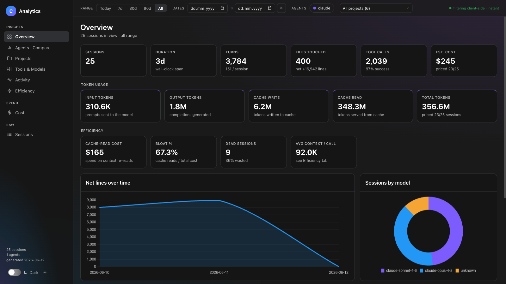
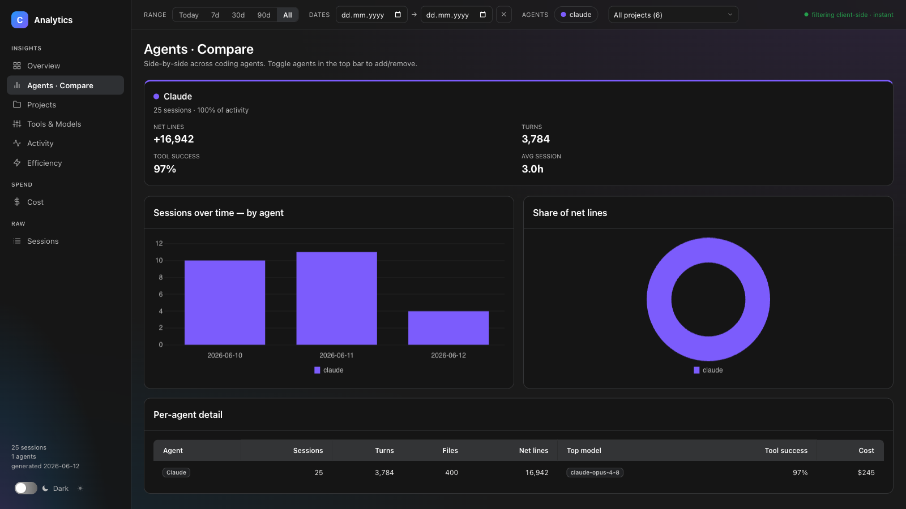
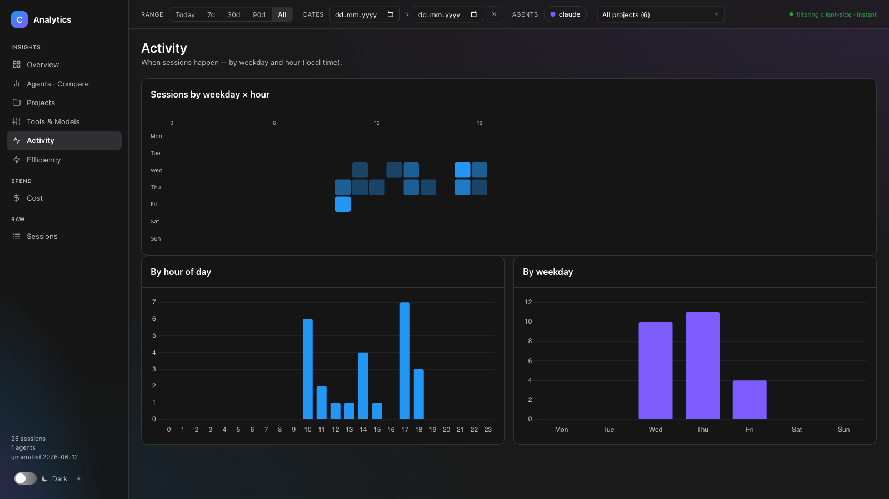
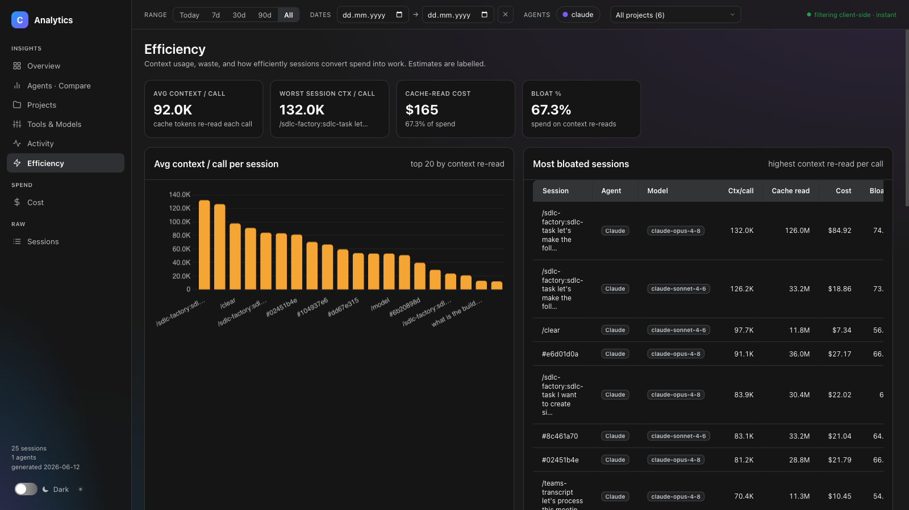
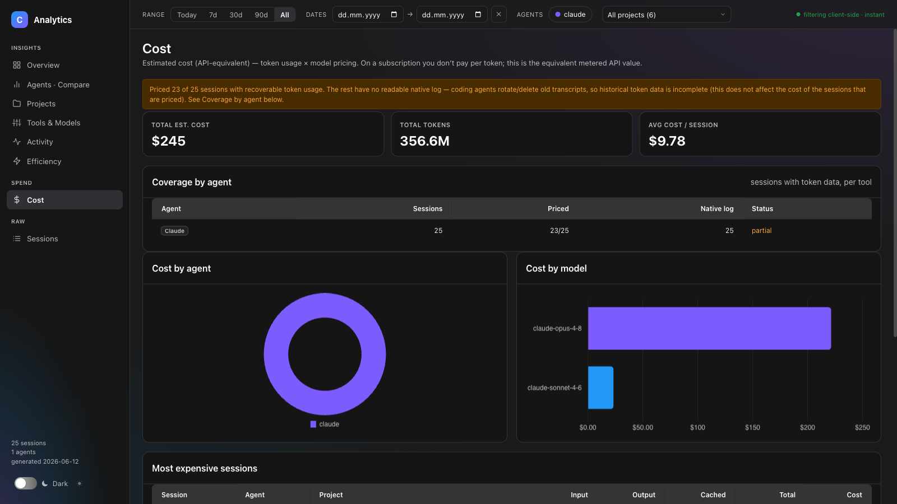
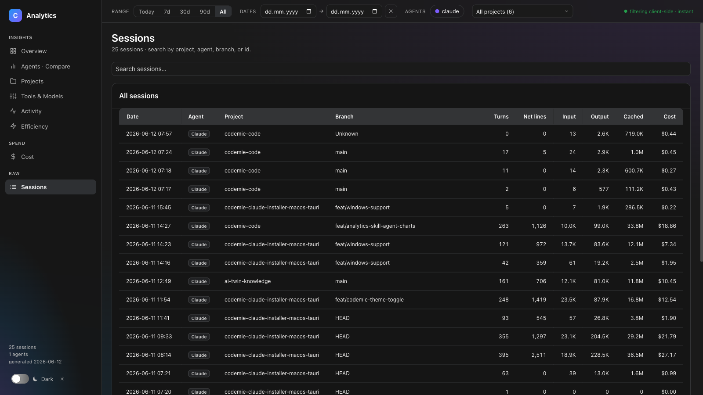
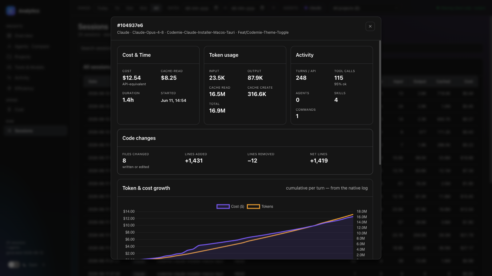

# Analytics Report

`codemie analytics --export` generates a **self-contained HTML dashboard** from your local AI session history. No server required — open the file in any browser and explore your data offline. Cost is always computed, whether or not you pass `--export`.

---

## Quick Start

```bash
# Generate report covering all tracked history and open it immediately
codemie analytics --open

# Last 7 days
codemie analytics --open --last 7d

# Specific date range
codemie analytics --open --from 2025-01-01 --to 2025-01-31

# Filter to one project
codemie analytics --open --project codemie-code

# Save to a specific path
codemie analytics --export -o ~/reports/weekly.html

# Also export the underlying data as JSON
codemie analytics --export both

# Include ALL local agent usage — also the sessions you ran outside CodeMie
codemie analytics --open --include-external
```

> **If your question is "what did AI actually cost us?", you probably want `--include-external`.**
> By default the report counts only sessions CodeMie launched. Any time you ran `claude`,
> `codex`, `gemini`, `pi`, or `copilot` directly, that spend is discovered but withheld.
> See [Session provenance](#session-provenance) for why, and for the trade-off.

---

## What the Report Covers

The dashboard reads every AI session CodeMie has tracked — Claude Code, Codex, Gemini, OpenCode, Pi, GitHub Copilot CLI, and the built-in agent — plus native agent logs it discovers automatically on disk. It builds a single portable HTML file with **nine interactive views**, grouped in the sidebar as *Insights*, *Spend*, and *Raw*.

Discovered sessions that CodeMie did not launch are **excluded by default**; see [Session provenance](#session-provenance).

---

## Views

### Overview



The landing view. Gives every headline number at a glance:

- **Sessions** — total count with wall-clock duration and turns per session
- **Files & lines** — file operations, lines added/removed, net change
- **Tool calls** — total calls and overall success rate
- **Estimated cost** — API-equivalent spend across priced sessions

Below the headline KPIs, two supplementary sections appear:

**Token usage** breaks down input tokens, output tokens, cache writes (tokens written to the prompt cache), and cache reads (tokens served back from cache), plus a combined total.

**Efficiency summary** shows cache-read cost, bloat percentage (cache reads as a share of total spend), dead session count, and average context per call — all linking to the Efficiency tab for full detail.

Charts: net lines over time (line chart by day) and sessions by model (doughnut). A **Top projects** table rounds out the view with per-project file and line counts, each clickable to open a project drill-down modal.

---

### Agents · Compare



Side-by-side comparison across every AI agent that has sessions in the data. For each agent: session count and share of total activity, net lines, turns, tool success rate, and average session duration.

Charts: stacked sessions-per-day by agent, and a doughnut of net lines by agent. A summary table covers sessions, turns, files, net lines, top model, tool success rate, and cost per agent.

Toggle individual agents on or off with the agent pills in the top filter bar to isolate the agents you care about.

---

### Projects

Expandable table of every project. Click a row to reveal its branches; click the project name to open the project modal with a full session list. Columns: sessions, turns, files changed, lines added/removed, net lines, tool success rate, cost.

---

### Tools & Models

Per-tool usage breakdown: call count and success rate rendered as horizontal progress bars (green ≥ 90%, amber ≥ 70%, red below). Token volume by model shown as a horizontal bar chart.

Three additional invocation charts show the top **skills invoked**, **agent subtypes**, and **slash commands** used — ranked by call count across all sessions in view.

---

### Activity



Heat map of sessions by weekday × hour of day (local time). Instantly shows when people are actually working with AI. Supported by two bar charts: sessions by hour of day and sessions by weekday.

---

### Efficiency



Focuses on context waste and productivity. Key metrics:

- **Average context / call** — how many cache tokens are re-read on each turn (a proxy for prompt bloat)
- **Bloat %** — cache-read cost as a fraction of total spend
- **Dead sessions** — sessions that consumed real cost but produced zero file changes and zero net lines (pure inference waste)
- **Session depth** — histogram of turns per session to surface sessions that were never compacted or restarted
- **Command effectiveness** — estimated cost per file changed, broken down by dominant slash command
- **Code changes summary** — files written vs. edited, lines added/removed/net

A ranked table of the most bloated sessions and the dead-session list are both clickable to open the session detail modal.

---

### Frameworks · Compare

Groups all sessions by **detected framework or tooling signal** (source classification). For each framework — CodeMie AI Factory, Superpowers, SpecKit, BMAD, OpenSpec, and Pure chat — shows a compact per-session summary plus adoption share.

**What it shows:**

- **Source comparison table** — one row per framework, columns: session count, adoption share (% of sessions in current view), per-session averages (turns, cost, net lines, files changed), and tool success rate. Rows sorted by session count descending.
- **Adoption doughnut chart** — visual share of sessions by source, sized by session count.

Both table and chart respect active date-range, agent, and project filters; adoption share is always relative to sessions in the filtered view (never the full dataset).

**How sources are detected:**

Framework classification is invocation-name-based, implemented in `session-source-detector.ts`. Detectors run in priority order (first match wins); fallback to "Pure chat" if none match. See the [source detector](src/cli/commands/analytics/report/session-source-detector.ts) for the full list and matching patterns.

**Limitation:**

Metrics shown are generic per-session metrics aggregated by source — **no framework-specific or heuristic KPIs** such as spec adherence, task-completion rate, or cycle-time analysis. Session data carries no structured per-framework events, so these deeper signals are not yet available. This view answers *"how is adoption distributed?"* and *"how do session patterns differ by source?"* but not *"how effective is each framework for achieving its methodology goals?"*

---

### Cost



Estimated API-equivalent spend (token usage × model pricing). If you use Claude on a subscription, you don't pay per token — this view shows the equivalent metered-API value for benchmarking against alternatives or tracking consumption trends.

> **Why this reads lower than the terminal's live cost.** Cost here is counted **per API response**: each response's token usage is priced exactly once, matching how the provider bills and how Claude Code's own telemetry (`cost.usage`) records it. A single response is written to the native log across several lines (e.g. a `thinking` line and a `tool_use` line, each repeating the same usage), and the live statusline in the terminal sums those lines — so it over-counts multi-part responses and shows a higher number. For sessions heavy on extended thinking plus tool use, expect the report total to sit noticeably below the live statusline; the report figure is the authoritative, de-duplicated one.

Key elements:

- **Coverage banner** — tells you how many sessions were successfully priced and which agents have full, partial, or missing token data
- **Coverage by agent table** — per-agent breakdown of total sessions, priced sessions, sessions with a native log, and coverage status
- **Cost by agent** — doughnut chart
- **Cost by model** — horizontal bar chart of USD spend per model
- **Most expensive sessions** — top 10 ranked by cost, with per-session token breakdown (input, output, cached)
- **Unpriced models** / **Estimated models** / **Local models (free)** — the same lists shown in the terminal summary (see below)

---

### Model pricing resolution

Every observed model id is canonicalized before it is looked up in `src/utils/pricing.json`:

1. Strip a Bedrock `bedrock/`/`converse/` prefix (including the stacked `bedrock/converse/` form), the `<region>.anthropic.` prefix, and a trailing `-v<N>:<N>` suffix.
2. Strip vendor path prefixes: `kimi-code/`, `openai.`, `openai/`, `azure/`, `vertex_ai/`, `anthropic/`, and the dot-form `moonshotai.` and `qwen.` (e.g. `moonshotai.kimi-k2.5`, `qwen.qwen3-coder-480b-a35b-v1`).
3. Lowercase the id, turn dots into dashes, and turn `@` into `-` (so Vertex's `claude-x@20260205` normalizes the same as a dated id).
4. Strip a trailing `-vertex` suffix.

The canonical id is then looked up in order:

1. Exact match — this keeps distinct dated rows apart, e.g. `gpt-4o-2024-05-13`.
2. Exact match after stripping one trailing snapshot suffix — `-YYYYMMDD`, `-YYYY-MM-DD`, `-latest`, or `-preview`.
3. A version-first Claude id (`claude-<ver>-<family>`, e.g. `claude-4-5-sonnet`) reordered to the table's family-first form (`claude-<family>-<ver>`, e.g. `claude-sonnet-4-5`) and tried the same way — exact, then snapshot-stripped — only once steps 1-2 have failed on the id as observed. Reported as `match: 'reordered'`.
4. Otherwise the model is **unpriced**.

There is no family or tier fallback: `gpt-5.5` does not fall back to `gpt-5`'s price, and there is no assumption that a Claude tier's price stays flat across dated releases. The `reordered` step above is not a fallback in that sense — it maps an id onto an existing published row under its other, family-first spelling, never onto a different model. A model without its own row, or without a row reachable through the three lookup steps above, always shows as unpriced rather than being silently priced from a nearby model. `CODEMIE_PRICES` still overrides the vendored table, and the Bedrock regional premium still applies on top of the resolved price. A price-table build collision (two raw keys normalizing to the same table key with different prices) throws a `ConfigurationError`.

**`unpricedModels`** (report meta and terminal summary) lists every distinct model that could not be resolved by the rules above. **`estimatedModels`** lists distinct models that *were* priced, but from a `pricing.json` row marked `"estimated": true` — a tier estimate rather than a confirmed published price (cited in the row's own source note) — surfaced so you can see which numbers are estimates without treating them as errors. **`localModels`** lists distinct models served locally: a session launched with the `ollama` provider whose model tag is not an Ollama cloud tag (one ending in `-cloud` or `:cloud`, e.g. `gpt-oss:120b-cloud`) runs on your own hardware, so its usage is priced at $0, the session counts as priced, and its per-model cost line carries `local: true`. Ollama cloud tags stay unpriced, and the `:tag` check is applied only for the `ollama` provider — never by the general resolver above. A model appears in at most one of the three lists. OTEL-sourced reports carry no launch provider, so their `localModels` is always empty.

---

### Sessions



Full paginated table of every session (up to 300 shown; searchable). Columns: date, first prompt, agent, project, branch, source, turns, net lines, input/output/cached tokens, cost.

The **Source** column carries the framework classification described under [Frameworks · Compare](#frameworks--compare), so you can scan tooling adoption without leaving the raw table.

Click any row to open the **session detail modal**.

---

## Session Detail Modal



Clicking a session anywhere in the report opens a detail overlay with:

- **Cost & Time** — API-equivalent cost, cache-read cost, duration, start time
- **Token usage** — input, output, cache read, cache create, total
- **Activity** — turns, tool calls and success rate, agent/skill/command invocation counts
- **Code changes** — files changed, lines added/removed, net
- **Token & cost growth chart** — cumulative cost and token usage per turn (from the native log; shown when data is available)
- **Dispatch timeline** — Interactive Gantt of every top-level dispatch. A session bar spans the full activity window across the top, then each agent, skill, and slash-command dispatch is rendered as its own bar positioned by wall-clock start time, so each sits where it actually ran. The window is the union of the tracked session span and the dispatch span, so dispatches from a resumed or compacted session still place correctly. Short skills and zero-duration commands fall back to a minimum bar width so they stay visible as markers. Click any bar to open a detail panel on the right showing wall-clock duration, start offset from session start, top tool call counts, and — for agent and skill dispatches where usage can be attributed to their time window — estimated cost and token breakdown (input / output / cache read / cache write). Slash-command dispatches are point events with no window to attribute usage from, so they show timing only, never a cost.
- **Skills / Agent subtypes / Slash commands** — chip lists of what was invoked and how many times
- **Copy buttons** — copy the session ID or the transcript's file location to the clipboard, for pasting into a bug report or opening the raw log directly

---

## Filters

All filtering happens client-side — no server, instant response.

| Filter | Where | How |
|---|---|---|
| Time range | Top bar | Preset buttons: Today, 7d, 30d, 90d, All; or enter custom From/To dates |
| Agent | Top bar | Toggle agent pills on/off |
| Project | Top bar | Dropdown of all projects in the data |

Filters apply to every view simultaneously. The URL does not update, so share the HTML file directly — recipients can apply their own filters.

---

## Output Formats

One flag, `--export [format]`, covers every output. It is optional-valued: bare `--export` means `html`.

| Format | Flag | Output |
|---|---|---|
| HTML dashboard | `--export` or `--export html` | Self-contained `.html` with all charts and data embedded |
| JSON data | `--export json` | The costed `ReportPayload` — the same session/meta schema as the dashboard's embedded data and the per-session exit report, useful for further analysis in notebooks or BI tools |
| Both | `--export both` | Writes the `.html` and the `.report.json` side by side with a shared base name |

`ReportPayload` (`{ meta, sessions }`) is the **only** JSON schema `codemie analytics` writes — there is no separate cost-less export format. `html`, `json`, and `both` are the only accepted `--export` values; anything else is rejected with an invalid-format error.

**`-o, --output <path>`** — one flag for choosing where files go:

- **No `-o`.** Files go to the current directory under the default names below, with a home/tmp fallback if the current directory turns out not to be writable (e.g. a read-only volume).
- **Directory target.** The path ends with a path separator, or names an existing directory. Each requested format is written inside it under its default name, so `--export both` produces the `.html` and the `.report.json` side by side.
- **File target.** Anything else. For `html` or `json` the path is used exactly as given. For `both`, a trailing `.html`/`.json` is stripped from the path and `<base>.html` plus `<base>.report.json` are written.
- A missing target directory (or parent directory of a file target) is created recursively. An explicit `-o` never falls back to home/tmp — a write failure there is a hard error naming the path.

Default output paths (no `-o`), in the current directory:

- HTML — `./codemie-analytics-<email-slug>-YYYY-MM-DD.html`
- JSON — `./codemie-analytics-<email-slug>-YYYY-MM-DD.report.json`

The JSON output deliberately ends in `.report.json` rather than `.json` so a directory holding both formats never has one file overwrite the other.

**`--open`** opens the generated HTML report in the default browser. With no `--export` given, `--open` implies `--export html`. `--open --export json` has no HTML to open, so it prints a "no HTML produced" notice instead.

**Report metadata and your email.** Reports embed the reporting user's email plus the period covered. The address is read from your CodeMie config; if it is missing and you're on an interactive terminal, report generation warns and prompts for it once, then saves it for future runs. Declining the prompt cancels report generation. The `<email-slug>` segment is dropped from the filenames when no email is available.

---

## Automatic Per-Session Report on Exit

When an interactive agent session exits — `codemie-claude`, `codemie-codex`, `codemie-opencode`, `codemie-pi`, or `codemie-copilot` — CodeMie automatically writes a JSON analytics report for that session to `./docs/codemie/analytics/codemie-analytics-<session_id>.json`.

- **Enabled by default** — it runs in-process as part of session finalization, not as a separate command.
- **Disable per run** with `--no-analytics-report`, e.g. `codemie claude --no-analytics-report ...` (the flag is available on every agent that supports the feature).
- **Non-fatal** — a failure never blocks session exit, and the report is skipped when the session produced no analytics data.

---

## Data Sources

CodeMie merges two sources to give the most complete picture:

1. **Tracked sessions** — metrics written by the CodeMie hooks during sessions CodeMie launched
2. **Native agent logs** — transcripts left on disk by `claude`, `codex`, `gemini`, `pi`, and `copilot`, discovered automatically and deduped against tracked sessions

Native-log discovery always runs; which discovered sessions are counted is decided by their provenance (below).

Discovery looks back as far as your date filter requires: with `--from` or `--last` the window is that range, and with no lower bound it is effectively unlimited.

Cost enrichment requires the native log to read per-turn token data. Sessions where the log has already been rotated or deleted will appear with `—` cost; the **Coverage** section in the Cost view shows exactly which sessions are priced.

<a id="session-provenance"></a>

### Session provenance — and why some sessions are hidden

Finding a native log is not the same as counting it. Every discovered session is tagged with a **provenance**, recorded on the session's start event as `provider`:

| Provenance | Meaning | In the report by default? |
|---|---|---|
| `native` | CodeMie launched this session (`codemie-claude`, `codemie-codex`, …). Its transcript carries a `codemie_session_start` ownership marker. | ✅ Yes |
| `native-external` | The same agent, run **directly** — `claude`, `codex`, `gemini`, `pi`, `copilot` — with no CodeMie involvement, so no ownership marker. | ❌ **No** — opt in with `--include-external` |
| `native-unmanaged` | Reserved for agents CodeMie can only ever read analytics for and never launches. No agent currently carries this tag. | ✅ Yes |

The default exists so that a report titled "CodeMie usage" measures CodeMie usage: without the ownership gate, every unmanaged run of an agent CodeMie *can* manage would be silently folded into CodeMie's numbers.

That default is the right one for adoption reporting and the **wrong** one for consumption reporting. If you want total local AI spend across every agent on the machine, ask for it:

```bash
codemie analytics --open --include-external
```

**This is the flag that shows all of your local agent usage.** GitHub Copilot CLI sessions are included in the gate, so they too are absent from the default report.

One thing to know before you rely on the wider number:

- **It is broader but less precise.** An external session has no CodeMie run to attribute it to — no profile, no managed provider — and its cost depends entirely on a native log that may already have been rotated away. Expect a lower priced-session ratio in the Cost view's **Coverage** banner than you'd see for CodeMie-launched sessions.

`--include-external` applies to the default local-session source only. The `analytics otel` subcommand does not accept it — an OTEL events file has no notion of CodeMie ownership.

### OTEL events file (`analytics otel`)

As an alternative to the local-session sources above, the `analytics otel` subcommand builds the same report from a **flattened OTEL events file** (`otel-events.jsonl`) — for example, telemetry exported from a fleet or CI environment rather than the current machine's history.

```bash
# Report from an OTEL events file
codemie analytics otel --file ./otel-events.jsonl --open

# Scope to a single user (matches native user.email or user.id)
codemie analytics otel --file ./otel-events.jsonl --user jane@example.com --export json
```

With this source, **cost is authoritative**: it is read directly from each event's native `cost_usd`, so no native-log enrichment is needed and every session with token data is priced. Any event model with usage but no `cost_usd` is priced through the resolver described below; models that still don't resolve are listed in `unpricedModels`. All the same filter and export flags apply (`--from`/`--to`, `--project`, `--agent`, `--branch`, `--session`, `--export`, `-o`, `--open`, etc.); the time window and `--user` are applied to the raw events, and the remaining structural filters narrow the session set so a filtered report is never mislabeled.

---

## CLI Reference

```
codemie analytics [options]

Export flags:
  --export [fmt]             Write a report: html (default when bare), json, or both
  -o, --output <path>        Output file or directory (default: ./codemie-analytics-YYYY-MM-DD.{ext})
  --open                     Open the generated HTML report in the default browser
                              (implies --export html when --export is not given)

Filter flags:
  --last <duration>         Last N days/hours/minutes: 7d, 24h, 30m
  --from <YYYY-MM-DD>       Start date (inclusive)
  --to   <YYYY-MM-DD>       End date (inclusive)
  --project <pattern>       Filter by project name (basename, partial, or full path)
  --agent <name>            Filter by agent: claude, gemini, codex, etc.
  --branch <name>           Filter by git branch
  --session <id>            Filter to a single session

Source flags:
  --include-external        Also count local sessions CodeMie did not launch
                            (see "Session provenance")

Other flags:
  -v, --verbose             Session-level breakdown in the terminal output
```

The report-generation flags shown above are the complete set. Any other flag name is rejected as unknown, and an unsupported `--export` value is reported as an invalid-format error.

**Every filter and source flag governs the terminal output and the HTML report alike.** There is no report-only or terminal-only filtering: `--include-external` and the date/project/agent filters all decide which sessions the command sees, and both outputs are rendered from that same set.

**Cost is always computed**, with or without `--export`. The terminal summary always shows the total cost, `Priced sessions: <priced>/<total>`, and (when non-empty) an `Unpriced models:` list, an `Estimated models:` list and a `Local models (free):` list.

The date filters control which sessions are **embedded** in the report; the client-side range presets (Today / 7d / 30d / 90d) then let the report viewer narrow further within that data.

### OTEL source subcommand

```
codemie analytics otel --file <path> [options]

  --file <path>             Path to the flattened OTEL events file (required)
  --user <id>               Scope to one user (native user.email or user.id)
```

All filter, report, and export flags from the base command also apply to `analytics otel`. The source flag does not: an OTEL events file is not gated on CodeMie ownership, so `--include-external` has no meaning here. Cost is read from each event's native `cost_usd`.
