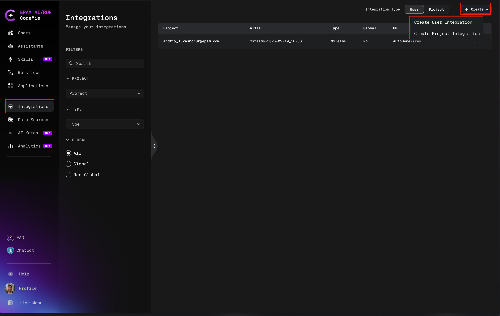
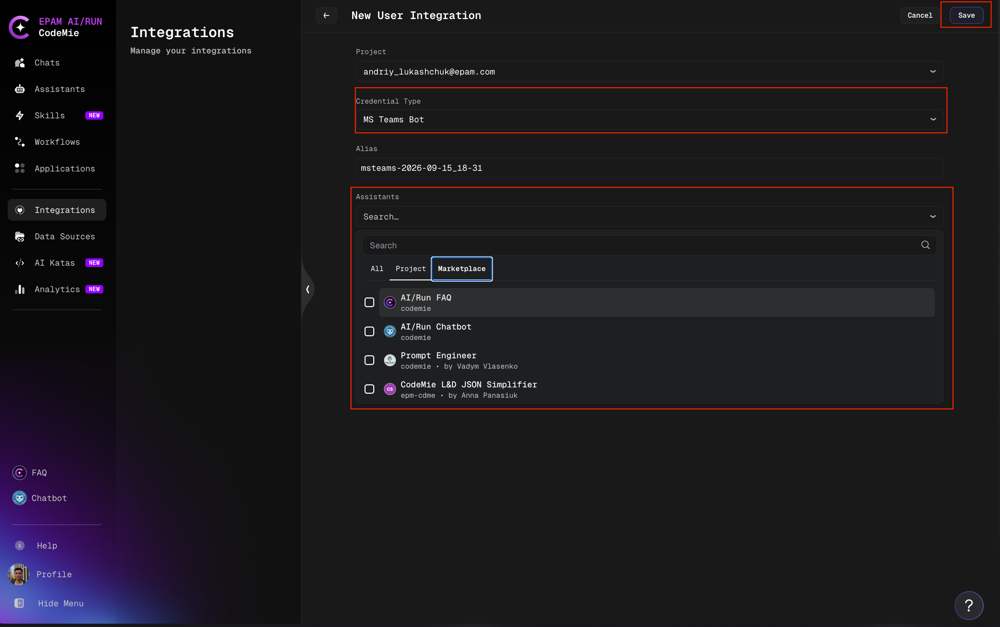
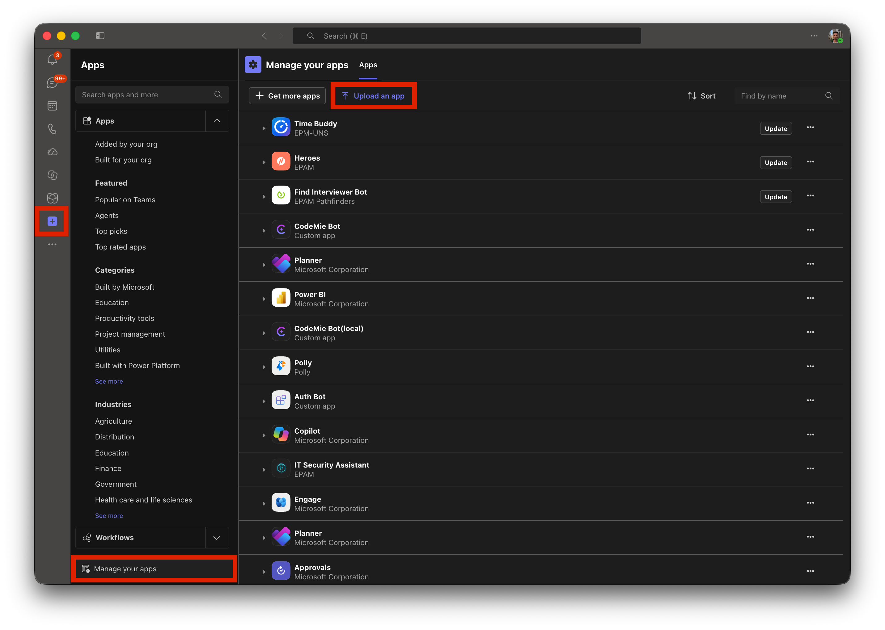
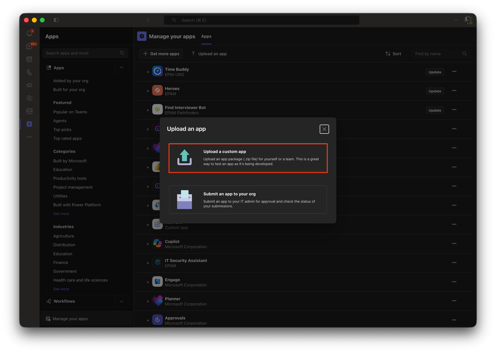
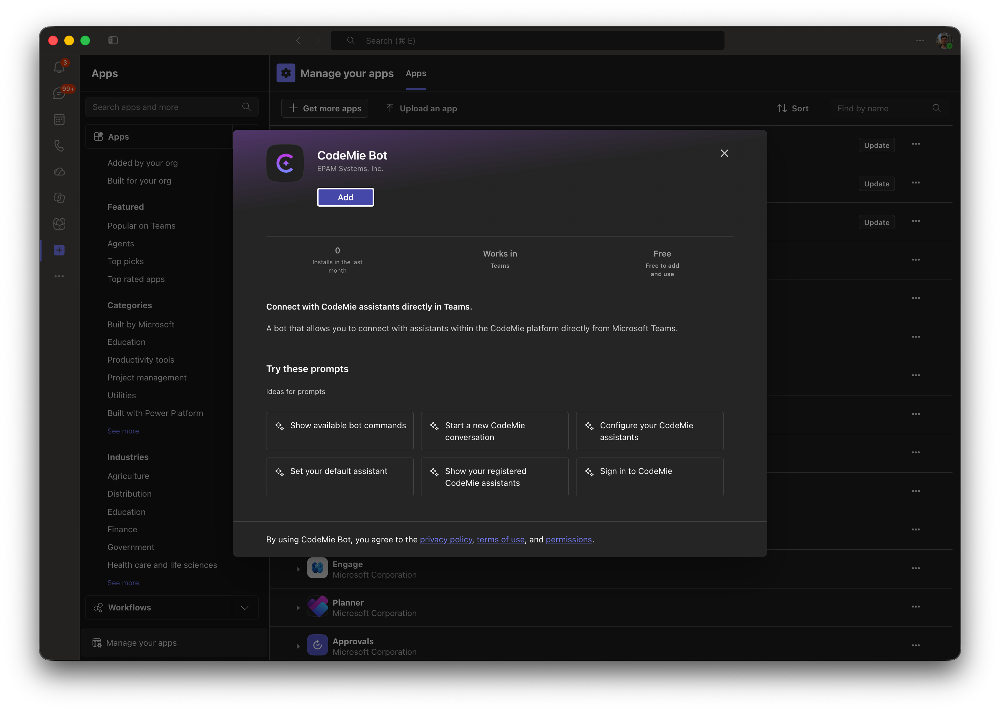
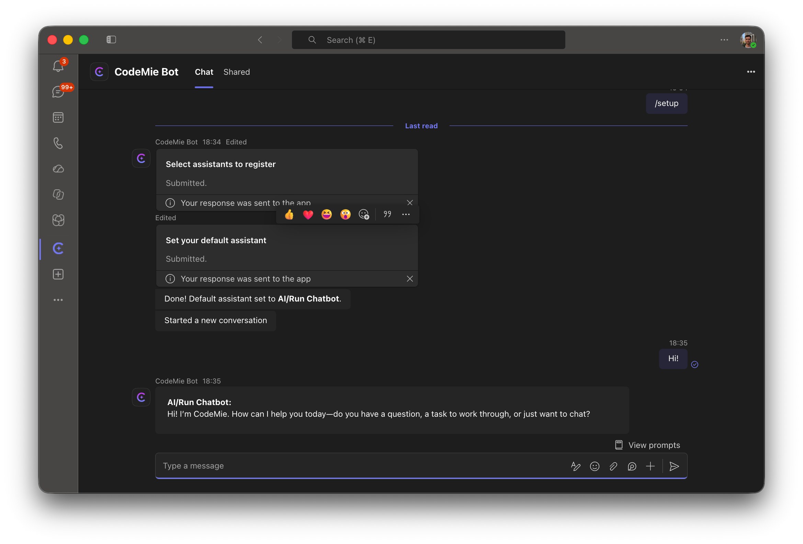

# Installing the CodeMie Bot in Teams

This guide walks you through adding an already-built CodeMie bot package to a Teams team, group
chat, or your personal chat. 

## Before you start

- **Ask your Teams admin to enable custom app sideloading**, if it isn't already. They can do
  this in the Teams Admin Center under **Teams apps → Setup policies → Upload custom apps**.
  If you don't see the upload option in step 2 below, this is almost always why.
- **Have the app package ready.** You'll find it right here in this folder:
  `codemieTeamsBotV1.1.9.zip`.
  
## Step 1 — Set up assistants for MS Teams in CodeMie

## Step 2 — Open "Upload an app"

In Teams, go to **Apps → Manage your apps → Upload an app**.

## Step 3 — Upload the package

Choose **Upload a custom app**, then pick `codemieTeamsBotV1.1.9.zip` from this folder.

## Step 4 — Review and add

Everything look right? Click **Add**.

## Step 5 — Choose where to add it

The bot works in two places — pick whichever fits what you need:

- **Personal chats**
- **Group chats and channel chats** (has access to history)

## Step 6 — Sign in

In a personal chat, send `/signin` or any message and the bot will reply with a sign-in card — just follow the prompt to authenticate.

## Step 7 — Set up assistants

Run `/setup` and select the assistants previously enabled in CodeMie integrations.

You need to run `/setup` in each chat where you want the bot to have assistants configured.

In group chats or channels, running `/setup` configures the available assistants for other users in that chat as well.

## FAQ

| What you're seeing | What's going on |
|---|---|
| No "Upload a custom app" option | Sideloading is turned off for your tenant — ask your Teams admin to enable it |
| No autocomplete for slash commands in personal chats | Not supported in personal chats — use the **View Prompts** button instead |

