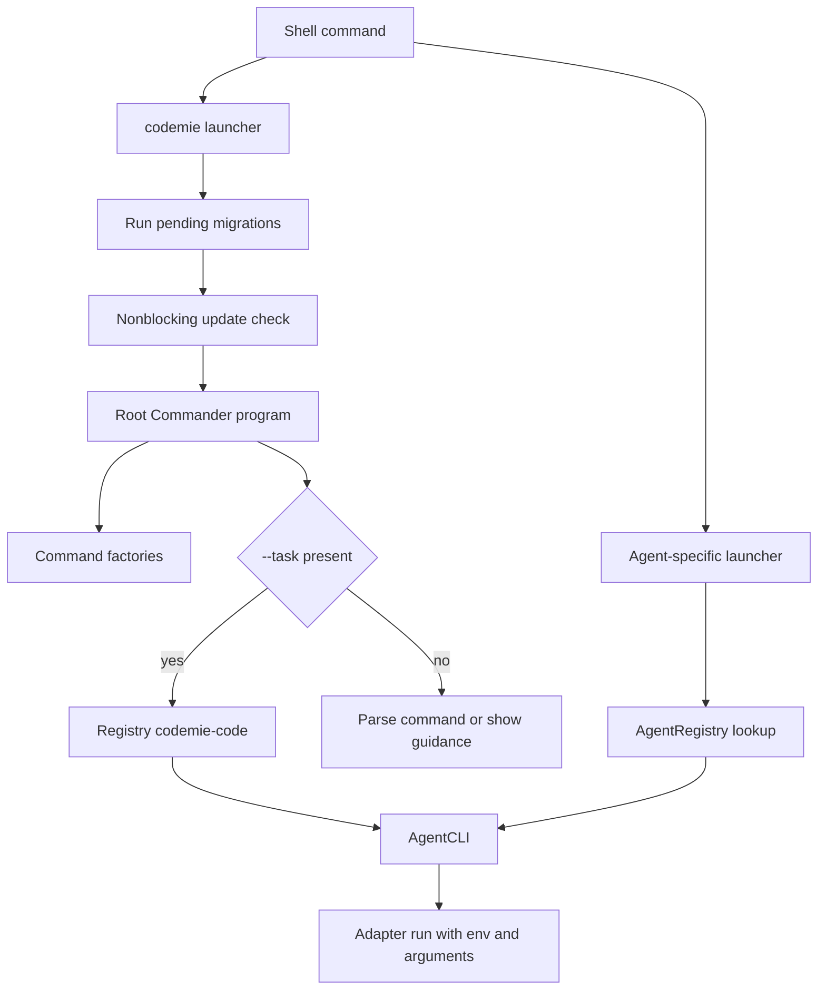

# CLI, Binaries, and Command Factories

`@codemieai/code` is an ESM Node.js package (Node 20 or newer) whose executable API is declared by `package.json` and whose library API begins at `dist/index.js` with declarations at `dist/index.d.ts`. The published `bin/` directory is part of the package, so the JavaScript launchers—not TypeScript source paths—are the stable process entry points. [package.json](repo://package.json#L2-L30) [package.json](repo://package.json#L188-L190)

## Published executables

| Executable | Published launcher | Role |
|---|---|---|
| `codemie` | `bin/codemie.js` | Management CLI: setup, profiles, agents, workflows, diagnostics, telemetry, MCP, proxy, and codebase operations. |
| `codemie-code` | `bin/agent-executor.js` | Built-in CodeMie agent launcher. |
| `codemie-claude`, `codemie-claude-acp`, `codemie-gemini`, `codemie-opencode`, `codemie-pi`, `codemie-codex`, `codemie-kimi`, `codemie-kimi-acp` | corresponding `bin/codemie-*.js` | A direct, agent-specific Commander surface created from the registered adapter. ACP variants are editor/Agent Communication Protocol adapters. |
| `codemie-copilot` | `bin/codemie-copilot.js` | Agent launcher with Copilot-specific model selection/listing and persisted selection before delegation to the common agent CLI. |
| `codemie-mcp-proxy` | `bin/codemie-mcp-proxy.js` | Minimal stdio JSON-RPC to HTTP MCP bridge process. |
| `proxy-daemon` | `bin/proxy-daemon.js` | Thin launcher for the detached local gateway daemon implementation. |

The complete executable-to-launcher mapping is the package `bin` field; adding an implementation without adding it there does not publish a shell command. The direct agent wrappers look up a named adapter in `AgentRegistry`, fail with exit status 1 if it is absent, then construct `AgentCLI` and parse the original `process.argv`. Separate entry files avoid Windows npm wrapper detection issues for agent commands. [package.json](repo://package.json#L8-L21) [bin/agent-executor.js](repo://bin/agent-executor.js#L3-L24) [bin/codemie-claude.js](repo://bin/codemie-claude.js#L3-L18) [bin/codemie-claude-acp.js](repo://bin/codemie-claude-acp.js#L3-L21)

The registry is the boundary between launchers and integrations. It lazily registers the built-in, Claude/Claude ACP, Gemini, OpenCode, Codex, Pi, Kimi/Kimi ACP, and Copilot plugins on first access; a wrapper therefore selects behavior by registry key rather than importing an integration-specific adapter. Agent-management consumers must use `getManageableAgents()`, which excludes analytics-only adapters, while telemetry may use the full registry. [src/agents/registry.ts](repo://src/agents/registry.ts#L17-L74) [src/agents/registry.ts](repo://src/agents/registry.ts#L76-L129)

## Root Commander program

Importing `src/cli/index.ts` creates the `codemie` Commander program. It first imports provider and framework plugin indexes for registration side effects, reads the package version with a fallback, and attaches command factories. Factories keep each domain independently constructible and testable; the root is deliberately composition rather than a monolithic command handler. [src/cli/index.ts](repo://src/cli/index.ts#L1-L60) [src/cli/index.ts](repo://src/cli/index.ts#L78-L104)

The root mounts factories for `setup`, `profile`, `assistants`, agent lifecycle (`list`, `install`, `uninstall`, `update`), `self-update`, `doctor`, `version`, `workflow`, `analytics`, `log`, `hook`, `sound`, singular `skill` and plural `skills`, `plugin`, OpenCode and test metrics, `models`, `sdk`, `mcp`, `mcp-proxy`, `proxy`, and `codebase`. Treat the factory return value—not a global program—as the extension seam for a command family. [src/cli/index.ts](repo://src/cli/index.ts#L14-L40) [src/cli/index.ts](repo://src/cli/index.ts#L78-L104)

There are two exceptional root paths:

* `codemie --task <task>` bypasses the management command tree, resolves `codemie-code`, and delegates the entire argv to `AgentCLI`; lookup or launch failure exits nonzero.
* Invoking bare `codemie` does not immediately call Commander parsing. It presents first-run welcome guidance or a returning-user quick start, falling back to normal help if that detection fails. All other invocations parse normally.

[src/cli/index.ts](repo://src/cli/index.ts#L106-L145)

This shows the two public CLI routes: the management root and direct agent wrappers converging on the registry-backed agent runner.

### Startup policy

The `codemie` launcher runs pending migrations before loading the main CLI. Migrations are tracked in `~/.codemie/migrations.json`; migration errors are warned but do not prevent use. It then performs an update check unless running under Node test/Vitest; that check is also explicitly non-fatal. A failure importing the compiled root CLI is fatal. In contrast, the MCP binary intentionally skips migrations, updates, and plugin loading because stdout must remain an uncorrupted JSON-RPC channel. [bin/codemie.js](repo://bin/codemie.js#L8-L39) [bin/codemie-mcp-proxy.js](repo://bin/codemie-mcp-proxy.js#L3-L13)

## AgentCLI: common shortcut-agent contract

`AgentCLI` derives its program name from adapter metadata (`codemie-` is not duplicated), sets the logger agent name, and exposes common wrapper options for profile/provider/model/auth/base URL/timeout/reasoning effort, task execution, session resume, status, silence, analytics reporting, and OpenCode config printing. It permits unknown options and retains positional arguments so native agent syntax can pass through. Every wrapper also has `health`; only Claude, Codex, and Gemini receive the nested `setup assistants` and `setup skills` commands; `init` is added only when the native adapter does not own it. [src/agents/core/AgentCLI.ts](repo://src/agents/core/AgentCLI.ts#L29-L44) [src/agents/core/AgentCLI.ts](repo://src/agents/core/AgentCLI.ts#L63-L140) [src/agents/core/AgentCLI.ts](repo://src/agents/core/AgentCLI.ts#L638-L640)

Before launching an adapter, the runner enforces the operational boundary: installed agent, valid configuration, required credentials (except SSO/JWT alternatives), provider/model compatibility, and a valid reasoning-effort value. `--jwt-token` takes precedence over profile authentication, selects bearer defaults when no config exists, and normalizes the CodeMie API path. `--task` and `--print-config` enable silent mode; config printing is valid only for OpenCode. The runner serializes the resolved profile into environment variables, adds profile/version/status/analytics controls, then calls `adapter.run()` with only agent-facing arguments. Errors are presented and logged before exit 1. [src/agents/core/AgentCLI.ts](repo://src/agents/core/AgentCLI.ts#L158-L280) [src/agents/core/AgentCLI.ts](repo://src/agents/core/AgentCLI.ts#L342-L374) [src/agents/core/AgentCLI.ts](repo://src/agents/core/AgentCLI.ts#L453-L471) [src/agents/core/AgentCLI.ts](repo://src/agents/core/AgentCLI.ts#L591-L617)

Resume is guarded as a telemetry ownership boundary. The adapter may recognize either CodeMie `--resume` or its native resume syntax and resolve ownership. If it identifies an external session, noninteractive input (no TTY or `CODEMIE_NO_PROMPTS=1`) blocks it. An interactive user may explicitly continue, in which case `CODEMIE_SESSION_ORIGIN=external-resume` is injected into the child environment and an audit event is recorded, preventing that session from being ingested as a CodeMie session. Resolver failure is deliberately non-blocking. [src/agents/core/AgentCLI.ts](repo://src/agents/core/AgentCLI.ts#L376-L448) [src/agents/core/AgentCLI.ts](repo://src/agents/core/AgentCLI.ts#L697-L755) [src/agents/core/__tests__/AgentCLI-resume.test.ts](repo://src/agents/core/__tests__/AgentCLI-resume.test.ts#L59-L139)

`codemie-copilot` is the intentional wrapper exception: before registry lookup it parses its model-related options, resolves models using the active configuration, can print `--model-list`, and prompts/persists a selection when `--model` has no value. A saved selection is applied only when neither CLI nor environment supplied a model. [bin/codemie-copilot.js](repo://bin/codemie-copilot.js#L18-L30) [bin/codemie-copilot.js](repo://bin/codemie-copilot.js#L188-L224)

## MCP and daemon process surfaces

The root `codemie mcp-proxy <url>` factory and the quiet `codemie-mcp-proxy <url>` binary both validate a URL, construct `StdioHttpBridge`, arrange SIGINT/SIGTERM shutdown, and exit nonzero on a fatal startup error. The binary logs boot diagnostics to `~/.codemie/logs/mcp-proxy.log` instead of stdout and dynamically imports the bridge only after validation. [src/cli/commands/mcp-proxy.ts](repo://src/cli/commands/mcp-proxy.ts#L16-L56) [bin/codemie-mcp-proxy.js](repo://bin/codemie-mcp-proxy.js#L19-L90)

The bridge starts stdio immediately but defers HTTP transport creation until the first JSON-RPC message. It queues messages during connection, performs OAuth on an unauthorized start or first send, retries queued traffic, maintains cookies per origin, forwards HTTP replies to stdio, and closes OAuth, HTTP, and stdio resources idempotently on shutdown. A forwarding connection failure exits the process, which lets an MCP host observe failure rather than silently losing requests. [src/mcp/stdio-http-bridge.ts](repo://src/mcp/stdio-http-bridge.ts#L87-L158) [src/mcp/stdio-http-bridge.ts](repo://src/mcp/stdio-http-bridge.ts#L160-L207) [src/mcp/stdio-http-bridge.ts](repo://src/mcp/stdio-http-bridge.ts#L293-L346)

`codemie proxy` is a root factory for a managed local gateway process. `proxy start` loads a named profile, rejects a differently configured live daemon but treats an identical one as idempotent, verifies credentials, attempts skill synchronization without making synchronization failure fatal, then asks the daemon manager to spawn and await readiness. `proxy stop` is idempotent; status can perform a deeper reachability check or emit machine-readable JSON. The nested-command design enables desktop/editor connection operations; its aliases merge parent and leaf options so Commander nesting cannot drop `--profile`, `--verbose`, `--force`, or `--insiders`. [src/cli/commands/proxy/index.ts](repo://src/cli/commands/proxy/index.ts#L62-L90) [src/cli/commands/proxy/index.ts](repo://src/cli/commands/proxy/index.ts#L108-L189) [src/cli/commands/proxy/__tests__/connect-wiring.test.ts](repo://src/cli/commands/proxy/__tests__/connect-wiring.test.ts#L101-L182)

The daemon manager spawns `bin/proxy-daemon.js`, polls its state file for up to five seconds, and clears stale state when a recorded PID is dead. Stop sends SIGTERM, waits five seconds, then escalates to SIGKILL and always removes state. The daemon validates required `--target-url` and `--state-file` and a positive port; it binds explicitly to `127.0.0.1`, atomically persists its live state, removes it during signal cleanup, and runs a 30-second health watcher that can restart up to three times on the same pinned port before recording an unhealthy state. [src/cli/commands/proxy/daemon-manager.ts](repo://src/cli/commands/proxy/daemon-manager.ts#L32-L81) [src/cli/commands/proxy/daemon-manager.ts](repo://src/cli/commands/proxy/daemon-manager.ts#L96-L187) [src/bin/proxy-daemon.ts](repo://src/bin/proxy-daemon.ts#L30-L90) [src/bin/proxy-daemon.ts](repo://src/bin/proxy-daemon.ts#L97-L128) [src/bin/proxy-daemon.ts](repo://src/bin/proxy-daemon.ts#L160-L203)

The focused integration lifecycle test is release-critical because it uses the actual `bin/proxy-daemon.js` and compiled daemon: it checks detached spawn, state/readiness, local `/health`, SIGTERM shutdown, PID death, and state cleanup. It uses a temporary `CODEMIE_HOME` and a dummy JWT token so `/health` is deterministic and credential-free; it skips when `dist` is not built. [tests/integration/proxy-daemon-lifecycle.test.ts](repo://tests/integration/proxy-daemon-lifecycle.test.ts#L4-L42) [tests/integration/proxy-daemon-lifecycle.test.ts](repo://tests/integration/proxy-daemon-lifecycle.test.ts#L65-L113) [tests/integration/proxy-daemon-lifecycle.test.ts](repo://tests/integration/proxy-daemon-lifecycle.test.ts#L139-L187)

## Programmatic package API

Consumers importing the package receive a deliberately small surface: `AgentRegistry` and `AgentAdapter`; `logger`, `exec`, and error exports; `EnvManager`; `CodeMieSSO`; `CodeMieProxy`; `getPluginRegistry` for external proxy-plugin registration; hook `processEvent` and `HookProcessingConfig`; and `ConfigLoader`. Importing deeper implementation modules couples callers to internals rather than this supported entry module. [src/index.ts](repo://src/index.ts#L1-L28)

## ESM and change rules

This is ESM (`"type": "module"`) compiled with NodeNext resolution. Source imports must include their emitted `.js` extension. Do not introduce `require()` or `__dirname`; obtain an ESM-safe directory with `getDirname(import.meta.url)`. Prefer the configured `@/` alias over new deep relative imports. These rules matter especially at entrypoint boundaries, where a syntactically accepted CommonJS pattern can fail after packaging. [package.json](repo://package.json#L2-L7) [tsconfig.json](repo://tsconfig.json#L2-L27) [AGENTS.md](repo://AGENTS.md#L163-L177)

When changing this surface, update the package `bin` map and its launcher together, preserve the launcher-to-registry-to-plugin layering, keep MCP stdout protocol-clean, and test command factories under their real root nesting. The Vitest configuration separates fast Node unit tests, no-network CLI integration tests, and built, network-capable agent integration tests; all resolve `@` to `src`. [vitest.config.ts](repo://vitest.config.ts#L14-L97)
