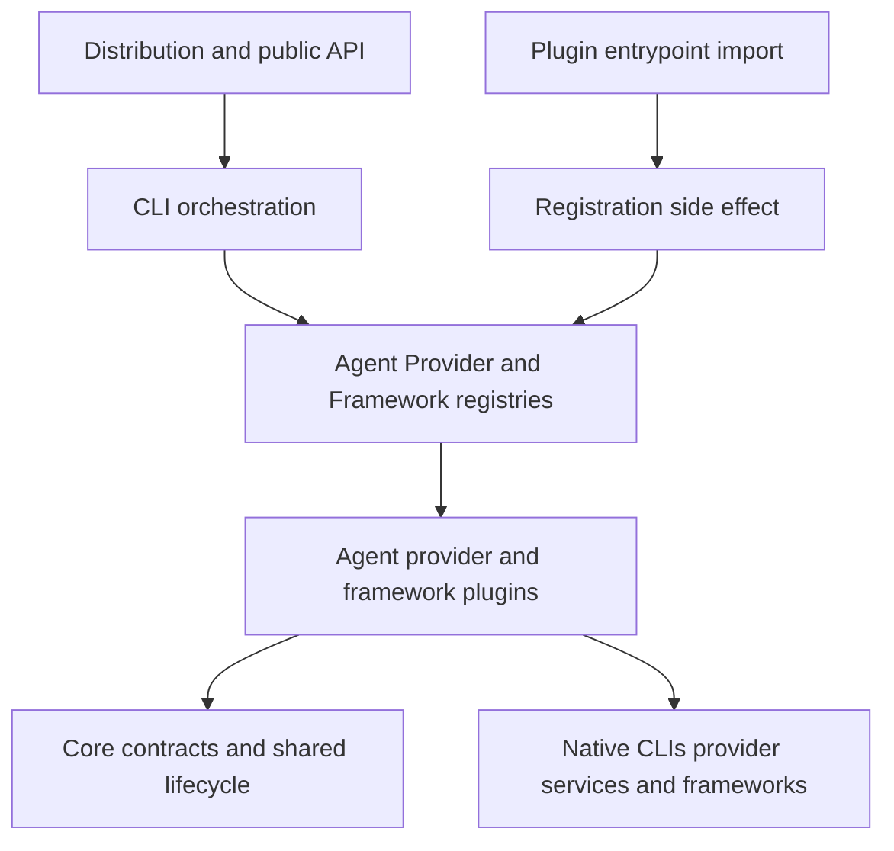

## Architectural intent

CodeMie is a Node.js ESM package that delivers both a command-line product and a small programmatic API. Its extensibility model separates user-facing command handling from integration-specific behavior: agents wrap external coding CLIs, providers describe connectivity and provider-specific behavior, and frameworks integrate development-framework tooling. Registries are the composition boundary between those consumers and implementations.

The five layers, from command invocation to the outside system, are:

1. **Distribution and public API** — `package.json` declares the ESM package, compiled `dist` entrypoint, and executable shims; `src/index.ts` deliberately exports only selected programmatic facilities.
2. **CLI orchestration** — `src/cli/index.ts` configures Commander and attaches product commands. `AgentCLI` builds an agent-specific command surface from an adapter.
3. **Registries and composition** — `AgentRegistry`, `ProviderRegistry`, and `FrameworkRegistry` hold integrations by stable name and resolve them for consumers.
4. **Plugin adapters and templates** — agent adapters implement management and launch behavior; provider templates contribute metadata, optional setup/model/health capabilities, environment export, and agent hooks; framework adapters manage and initialize framework tooling.
5. **External tools and services** — the native agent executable, provider endpoint or local runtime, and framework CLI are invoked only through their corresponding plugin behavior.

The essential dependency rule is **CLI → Registry → Plugin**. A command resolves a named capability from a registry and works through its contract; it must not select, import, or call a concrete integration implementation. Plugins may depend on core contracts and register themselves at an explicit composition boundary, but should not depend on CLI commands. This keeps a new integration localized to its plugin and registration entrypoint instead of spreading provider- or agent-specific branches through command code.

*The diagram shows the five runtime layers and the separate import-time path by which plugins populate registries.*

## Contracts define what a plugin owns

An agent plugin is an `AgentAdapter`: it exposes identity and read-only metadata, installation state and operations, `run`, version lookup, and optional capabilities such as session parsing, extension installation, native resume ownership, and analytics. `AgentMetadata` is the declarative boundary for installation commands, supported providers, environment-variable mapping, CLI flag translation, model compatibility, lifecycle defaults, local paths, MCP and extension locations, and analytics behavior. The generic CLI can therefore build and run an agent wrapper without knowing Claude-, Gemini-, or other vendor-specific details.

Provider plugins use `ProviderTemplate`. A template identifies the provider, default endpoint and authentication type, recommended models and capabilities, and can provide setup instructions. Provider-owned `exportEnvVars` prevents `ConfigLoader` from accumulating provider-specific fields; `agentHooks` supplies provider/agent lifecycle customization without placing provider knowledge in the agent plugin. For a lifecycle hook, resolution checks a provider wildcard hook, then an agent-specific provider hook, and otherwise uses the agent default; when both provider hooks exist, wildcard runs before the agent-specific hook. A wildcard hook can also precede the agent default.

Framework plugins implement `FrameworkAdapter`, including install/uninstall, initialization, availability checks, agent-name mapping, and version lookup. The framework registry filters registered frameworks by the adapter's `supportedAgents`; an absent or empty list means it supports every agent.

This split has an important operational boundary: `getAllAgents()` includes analytics-only adapters so the analytics pipeline can resolve their session adapters, but management surfaces must use `getManageableAgents()` or `getInstalledAgents()`. The latter two exclude adapters whose metadata sets `analyticsOnly`; this avoids advertising install/update actions for an externally managed tool and avoids a destructive global npm update.

## Registration lifecycle and lookup failures

Registration is intentionally a mix of lazy agent composition and import-time provider/framework composition:

- The first `AgentRegistry` lookup initializes its private maps and instantiates the built-in agent plugin set. Registration also captures an agent metadata analytics adapter when present. Unknown agent names resolve to `undefined`.
- Importing `src/providers/index.ts` imports each built-in provider plugin. Provider templates call `registerProvider`, which stores them in `ProviderRegistry`; the same registry separately stores health checks, model fetchers, and setup steps. `src/cli/index.ts` imports this entrypoint before creating commands, so those provider side effects have executed. A provider registry lookup returns `undefined` if no matching capability is registered.
- Importing `src/frameworks/index.ts` imports its plugin index, whose module body constructs and registers the built-in framework adapters. CLI code can dynamically import this entrypoint before consuming `FrameworkRegistry`.

Maps key registrations by name. In particular, provider registration is last-write-wins for duplicate names, so a duplicate is an override rather than an error. `ProviderRegistry.clear()` and `FrameworkRegistry.clear()`/`unregisterFramework()` are test/reset mechanisms; consumers must ensure the appropriate composition entrypoint has been imported after a clear. Agent initialization is guarded by an `initialized` flag and has no public clear/reset path.

At run time, configuration selects a provider name and the agent adapter uses `ProviderRegistry` to retrieve its template. An unauthenticated provider is never routed through the local proxy; proxy routing requires an SSO provider or JWT authentication *and* an agent whose metadata enables proxy support. Provider hooks and agent defaults then customize the session around execution rather than requiring a CLI command to understand each provider.

## Public entrypoints and import boundaries

There are three distinct entrypoint types; use the narrowest one appropriate to the caller:

| Entrypoint | Role |
| --- | --- |
| `src/index.ts` | Public package API: `AgentRegistry` and its adapter type, logging/process/error helpers, `EnvManager`, SSO and proxy classes, proxy-plugin registry access, hook processing, and `ConfigLoader`. |
| `src/providers/index.ts` | Provider module API and its composition entrypoint. It exports provider contracts/registry/base helpers and triggers built-in provider registration. |
| `src/frameworks/index.ts` | Framework module API and its composition entrypoint. It exports framework core and plugins, and triggers built-in framework registration. |
| `src/cli/index.ts` | Executable composition root, not a general library API. It initializes provider/framework plugins, adds Commander commands, and handles the `--task` fast path. |

For `codemie --task`, the CLI dynamically loads `AgentRegistry` and `AgentCLI`, asks the registry for `codemie-code`, then delegates the argv to that adapter's generic CLI. If the adapter cannot be resolved or execution fails, it reports the error and exits nonzero. This is the desired control flow: the CLI names a capability, the registry supplies it, and the plugin implements it.

Do not treat every source module as supported public API. Consumers that need provider registration should import the provider entrypoint (or use the explicitly exported provider APIs), and consumers that need framework registration should import the framework entrypoint. Importing only a registry core file does not itself load plugins.

## ESM and import conventions

The package declares `"type": "module"` and compiles with TypeScript `NodeNext` module and resolution settings. Source imports must use ESM and include the runtime `.js` extension even when the source file is TypeScript, for example `import { AgentRegistry } from '@/agents/registry.js';`. The TypeScript `@/*` path mapping resolves from `src`; prefer that alias for cross-feature imports instead of adding deep relative paths.

New production code should not introduce `require()` or CommonJS `__dirname`. Use `import.meta.url` with the repository's `getDirname` utility when a module-relative path is necessary. This is a migration rule as well as a style preference: one legacy production `require()` remains in the Claude conversations processor, and some compatibility/template code still uses `__dirname`; do not copy those patterns into new integration code.

## Safe extension workflow

1. Define the smallest applicable contract: `AgentAdapter` plus metadata, `ProviderTemplate` and optional capability implementations, or `FrameworkAdapter`.
2. Keep vendor- and provider-specific behavior in the plugin. Use agent metadata for declarative mappings and provider `agentHooks` for provider/agent differences; retain only provider-agnostic defaults in agent lifecycle metadata.
3. Add the plugin to its composition entrypoint: the lazy built-in list in `AgentRegistry`, a provider plugin imported by `src/providers/index.ts`, or `src/frameworks/plugins/index.ts`. Registration is required; merely exporting a class or template does not make it discoverable.
4. Consume it through the registry from CLI code. Preserve the management/analytics distinction for an analytics-only agent.
5. Add focused tests: agent-registry tests should assert the complete built-in name membership and adapter contract; provider registry tests should cover registration, lookup, and duplicate-name override. Run `npm run typecheck`, `npm run lint`, and the relevant Vitest project(s) before relying on a new integration.

These boundaries make initialization ordering observable. A missing composition import produces an absent registry lookup and the caller's unsupported/not-found behavior, rather than a hidden fallback to a concrete plugin. Conversely, importing a composition entrypoint intentionally has side effects, so it belongs at a startup boundary or explicit integration setup point.
