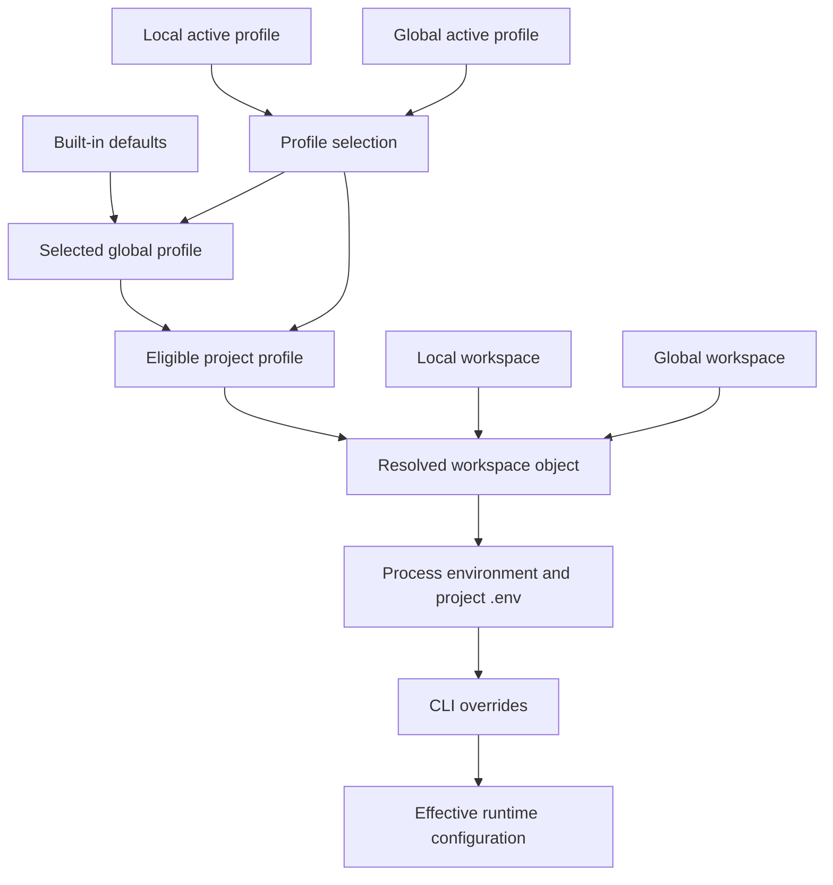

# Profiles, Configuration Precedence, and Local State

`ConfigLoader` is the runtime authority for configuration. It converts persisted configuration—legacy single-provider files or version-2 multi-provider documents—into one `CodeMieConfigOptions` object for an agent or command. Provider identity and repository/tooling context deliberately have different ownership: a profile holds provider-facing choices and credentials, while a scope-level `workspace` holds context shared when profiles change.

## Storage contract and document shape

The global configuration file is resolved as `getCodemiePath('codemie-cli.config.json')`; its default home is the user's `.codemie` directory, but `CODEMIE_HOME` relocates that home. Code must therefore use `getCodemieHome()` and `getCodemiePath()` rather than constructing a home-directory or `~/.codemie` path. The project file is relative to the working directory: `.codemie/codemie-cli.config.json`.

A v2 document has `version: 2`, an `activeProfile`, a `profiles` map, and optional top-level `workspace`, `codemieSkills`, `codemieAssistants`, and `userEmail`. A profile may contain provider, endpoint, API key, model, timeout/debug settings, model tiers, AWS settings, and SSO/JWT material. `workspace` instead owns CodeMie URL/project/integration selection, hooks, plugins, assistant history policy, skill-search endpoint, Claude compaction setting, and metrics settings. The runtime type is the union of these two shapes, but persistence must preserve the separation.

```json
{
  "version": 2,
  "activeProfile": "work",
  "profiles": {
    "work": {
      "provider": "ai-run",
      "baseUrl": "https://litellm.codemie.example.com",
      "apiKey": "your-litellm-api-key-here",
      "model": "claude-sonnet-4-6"
    }
  },
  "workspace": {
    "codeMieProject": "example-project"
  }
}
```

The example is structural only: never commit an actual API key. `saveProfile()` and `initProjectConfig()` split any mixed input so workspace keys are stored in the scope's `workspace`, not below `profiles[name]`. The first saved profile becomes active. Configurations in the older provider-shaped format are read as an in-memory `default` v2 profile; an invalid nonempty project document is rejected as not being v2.

## Resolution model

The ordinary field precedence is **CLI > environment > project > global > defaults**. Defaults include `name: 'default'`, provider `openai`, unlimited timeout (`0`), `debug: false`, an empty allowed-directory list, and standard ignored build/VCS directories. Before environment resolution, a project `.env` is loaded if present. Supported environment inputs include `CODEMIE_PROVIDER`, `CODEMIE_BASE_URL`, `CODEMIE_API_KEY`, `CODEMIE_MODEL`, `CODEMIE_TIMEOUT`, `CODEMIE_DEBUG`, `CODEMIE_ALLOWED_DIRS`, `CODEMIE_IGNORE_PATTERNS`, `CODEMIE_URL`, `CODEMIE_AUTH_METHOD`, and the integration ID/alias pair.



This shows profile selection, scope overlays, and final precedence. A local active profile wins selection when no explicit profile is supplied; otherwise the global active profile supplies the default. An explicit CLI profile selects that name. A same-named local profile overlays its global counterpart. If a selected global profile differs from the repository's local team profile, the loader does **not** apply that local provider/model/credential record, preventing the team profile from replacing the explicitly selected identity. A named profile that exists only locally can still load, and a locally selected name that exists only globally uses the global record.

Workspace follows a separate invariant: it is a whole-object choice, not a field merge. A non-null local `workspace` wins outright; otherwise the global `workspace` is used; otherwise it is empty. This prevents global context leaking into a partial local workspace and keeps context stable when the active provider profile changes. Treat an externally written `workspace: null` as absent so global fallback remains safe.

An explicit profile also protects its provider-specific identity from ambient environment values. Unless the corresponding CLI field is supplied, environment `baseUrl`, `apiKey`, `model`, `provider`, `codeMieUrl`, `authMethod`, and `codeMieIntegration` are filtered rather than overriding the chosen profile. Remaining environment and then CLI fields retain their normal higher precedence.

## Profiles and lifecycle operations

`ConfigLoader.listProfiles()` combines global records first and then local records, replacing same-named global entries with the local version; the active marker is local `activeProfile` when present, otherwise global. `getProfile()` is local-first. `switchProfile()` verifies that the name exists in the combined list, then writes the active-profile reference to the local document if one exists, otherwise globally. A local active reference may intentionally point to a global-only profile. Deletion likewise targets local storage whenever a project config exists; deleting the active profile selects the first remaining profile or an empty active value. Rename is a global-config operation.

The `codemie profile` command exposes listing, `status`, `login`, `logout`, `refresh`, `switch`, `delete`, and `rename`. `status --show-sources` uses `loadWithSources()` to attribute effective fields to `default`, `global`, `project`, `env`, or `cli`; displayed sensitive values are masked recursively. Normal status optionally calls provider setup hooks for authentication validation/status and can offer reauthentication. `login --url` takes precedence over the resolved workspace URL; `refresh` is only available to an SSO provider with a configured CodeMie URL and clears old credentials before authenticating again.

`loadAndValidate()` requires a resolved `baseUrl`, `apiKey`, and `model`, and validates hook schema when hooks are present. Use it at a boundary that requires a runnable provider; use `load()` where incomplete setup needs to be inspected or completed. Provider templates declare authentication type/capabilities and may implement `exportEnvVars(config)`, making provider-specific environment projection an extension point rather than loader-specific branching. The generic exporter clears stale auth-method and model-tier values with empty values where necessary, and provides `not-required` as the API-key value only for providers that declare no authentication requirement.

## Credentials, diagnostics, and logs

Credentials can occur in `apiKey`, JWT fields, encrypted SSO cookies, AWS secret material, environment variables, provider-specific properties, and request headers. Do not print a resolved config or credential-adjacent object. Source reporting masks keys/tokens/passwords and nested values, while SSO credential storage encrypts the serialized record, attempts the OS keychain, and also maintains encrypted file storage keyed by a hash of the normalized base URL.

For implementation diagnostics, use `logger.debug()` rather than raw `console.log` debug output. Pass credential-adjacent values through `sanitizeLogArgs()` at the call site—for example, `logger.debug('Provider setup failed', ...sanitizeLogArgs({ baseUrl, error }))`. This is important because log arguments can contain nested headers, cookies, keys, tokens, or error payloads. The logger sanitizes arguments before file writes, but debug console output receives its supplied arguments; explicit call-site sanitization prevents accidental terminal disclosure. The logger's files are placed with `getCodemiePath('logs')`, rotate across dates, and cleanup targets dated debug logs older than five days.

Keep secrets out of project-local config whenever a repository can be shared. Environment variables or profile-specific secure authentication flows are appropriate operational injection points, subject to the explicit-profile filtering behavior above. The `config.example.json` API-key field is a placeholder, not a credential distribution mechanism.

## Other local state

The CodeMie home also contains state beyond global configuration. `getInstallationId()` reads or creates a persistent UUID at `getCodemiePath('installation-id')`. Top-level registered skills and assistants are scoped global or local and are returned only if their corresponding `.claude/skills/.../SKILL.md` or `.claude/agents/...` artifact still exists; combined assistant loading gives local registrations precedence by ID. These are scope-level registrations rather than properties of the active provider profile.

## Change and test guidance

When changing resolution logic, test the observable composition, not only parser output:

- global/profile/local/CLI precedence and field-source attribution;
- explicit-profile isolation from environment credentials and a different local team profile;
- local-versus-global whole-workspace selection, including `workspace: null` fallback;
- local/global profile listing, active-reference switching, deletion fallback, and local-only/global-only names;
- v1-to-v2 read compatibility and rejection of invalid nonempty local files;
- redaction of nested keys, headers, and credential-bearing log arguments; and
- `CODEMIE_HOME` isolation, ensuring no test or feature embeds a machine-specific home path.

The focused configuration tests cover project initialization, precedence, workspace splitting, and source attribution; migration tests cover lifting workspace fields out of profiles. Security and agent print-config tests cover secret redaction. See [CLI Surface](../architecture/cli-surface.md), [Provider Plugins and Local Proxy](../integrations/provider-plugins-and-local-proxy.md), [Daemon Migrations and Diagnostics](../operations/daemon-migrations-and-diagnostics.md), [Test Strategy](../testing/test-strategy.md), and [Agent Launch and Session Telemetry](../workflows/agent-launch-and-session-telemetry.md) for the consumers and operations around this state.
