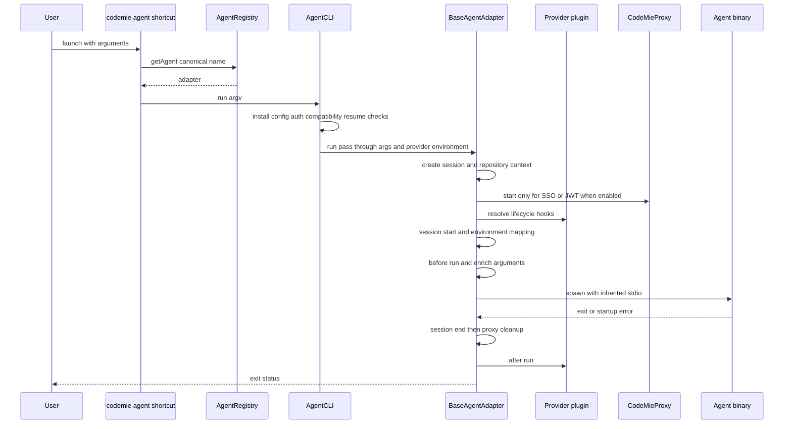

## Scope and architectural boundary

CodeMie treats an agent integration as an `AgentAdapter`: a metadata-driven wrapper around an external CLI or the built-in CodeMie Code runtime. The adapter owns agent-specific installation, executable discovery, native argument and environment conventions, session parsing, and optional extension or hook capabilities. The common runtime owns profile loading, authentication, proxy setup, compatibility gates, process supervision, and the lifecycle envelope.

Keep the boundary directional when adding or changing an agent:

```text
CLI command -> AgentRegistry -> AgentAdapter plugin -> native agent binary
```

The CLI must resolve an adapter through `AgentRegistry`; it should not import an individual plugin or duplicate its metadata. The registry lazily constructs the built-in set—CodeMie Code, Claude and Claude ACP, Gemini, OpenCode, Codex, Pi, Kimi and Kimi ACP, and Copilot CLI—and separately exposes any analytics adapters declared in plugin metadata.

`AgentMetadata` is the declarative part of the contract. In addition to identity and package/command information, it can describe supported and blocked provider/model combinations, version bounds, `CODEMIE_*` to native environment mappings, flag mappings, reasoning-effort injection, data/session locations, MCP and extension scan locations, lifecycle defaults, hook payload mapping, analytics, and installation hints. The operational interface supplies `install`, `uninstall`, `isInstalled`, `run`, `getVersion`, and optional version, session, resume-ownership, extension-installation, and analytics capabilities.

## Manageability and analytics are related but distinct

The registry keeps all adapters available because analytics discovery resolves session adapters through it. Management surfaces, however, must use `getManageableAgents()`, which excludes metadata marked `analyticsOnly`. This prevents `install`, `uninstall`, `update`, `list`, `doctor`, and first-run UI from advertising or altering a tool CodeMie only reads telemetry from. `getInstalledAgents()` similarly checks only manageable adapters.

An analytics-only adapter is a capability classification, not a weaker registry entry: it may still provide an analytics/session adapter, but it must not be installed, launched, or updated by CodeMie. In the current built-in registrations, Copilot CLI is explicitly a managed integration, not analytics-only; it has npm metadata and participates in management while also supplying a session adapter for analytics.

## Entry points and shortcut wrappers

The package publishes an umbrella `codemie` executable plus one executable per supported launch target, such as `codemie-claude`, `codemie-codex`, `codemie-opencode`, and `codemie-code`. Each shortcut is deliberately thin: it imports compiled ES modules with `.js` extensions, asks `AgentRegistry` for its canonical name, exits if absent, then gives the adapter to `AgentCLI` with `process.argv`. A shortcut therefore receives the same configuration, compatibility, proxy, and lifecycle handling as the umbrella command.

The launcher convention is `codemie-<agent>`, except that an adapter whose canonical name already starts with `codemie-` launches as that name. User-facing aliases are resolved before registry lookup; currently `copilot` maps to `copilot-cli`, and its preferred launcher is `codemie-copilot`.

`AgentCLI` builds the shared Commander surface: profile/provider/model/base URL/API-key/JWT/timeout overrides, `--task`, reasoning effort, resume, status, silent mode, report control, health, and pass-through arguments. It suppresses framework `init` if the native agent owns that subcommand, and provides `setup assistants` and `setup skills` only for Claude, Codex, and Gemini. It checks installation before configuration or launch; `--task` and `--print-config` force silent operation, and `--print-config` is accepted only for OpenCode.

## Install, update, and compatibility policy

`codemie install [name] [version]` resolves aliases and then the registry adapter. With no name it lists manageable agents; it never lists analytics-only integrations as installable. The installer prefers `--supported`, then an explicit version; Claude and Codex default to their tested supported version. A matching installed version is retained, but optional `additionalInstallation()` still runs. Otherwise installation calls `installVersion()` when a version was selected, or `install()`, restores the CodeMie bin link, verifies the detected version, and displays plugin-provided post-install hints or standard launcher examples.

The base adapter implements npm global installation/uninstallation for adapters with `npmPackage`, command-based presence detection, and `--version` lookup. Plugins can override this for native installers or special artifacts. CodeMie Code is a special built-in adapter: it checks for and installs the `@codemieai/codemie-opencode` whitelabel binary, and its uninstall also attempts to remove the platform package left hoisted by npm. Built-in agents cannot use the base external-agent installer.

`codemie update` also works only over manageable adapters. It treats Claude as a native supported-version update, updates the built-in agent by updating the CodeMie CLI package, and otherwise queries and force-installs the adapter's npm package. This is why accidentally making an external/analytics-only tool manageable is unsafe.

Before a version-managed adapter launches, the base adapter compares its installed version to `supportedVersion` and `minimumSupportedVersion`. A version below the minimum is a hard stop: silent/ACP mode throws so protocol stdout remains clean; interactive mode offers installation of the supported version or exit. A newer untested version and an older-but-not-minimum version produce interactive update/continue/exit choices. Semver parse failures are treated as incompatible. Claude illustrates the metadata policy with supported and minimum versions, native installer URLs, mapped Anthropic variables, and a lifecycle default which disables its auto-updater so the compatibility policy remains effective.

## Launch dispatch and lifecycle



This diagram shows normal adapter dispatch and the lifecycle around the native process.

`AgentCLI` loads the selected profile with command-line overrides, normalizes SSO/JWT API URLs, verifies required configuration and provider authentication, validates metadata provider/model compatibility, and exports the resulting provider environment. A `--jwt-token` overrides profile authentication. Reasoning effort is validated before the adapter sees it. On resume, an adapter may recognize its native positional resume syntax and resolve ownership. Resuming a session known to be external requires explicit interactive confirmation; non-interactive/no-prompt execution blocks it. Confirmation sets an environment marker so downstream session ingestion records the external origin and does not sync it as a CodeMie session.

`BaseAgentAdapter.run()` first generates the session UUID and repository/branch context, merges overrides into a `CODEMIE_*` environment, initializes the logger session, and conditionally starts the local proxy. A proxy is used only when the provider has SSO authentication or the request uses JWT **and** the agent enables proxy support; providers with `authType: 'none'` never use it. On startup the proxy replaces `CODEMIE_BASE_URL` with its local URL and uses a placeholder API key before agent-specific mapping.

The hook order is:

1. `onSessionStart`
2. map `CODEMIE_*` values into the agent's native environment
3. `beforeRun`
4. `enrichArgs`
5. declarative flag mapping and reasoning-effort injection
6. built-in handler or spawned native command
7. `onSessionEnd`, followed by proxy cleanup
8. `afterRun`, then the optional per-session analytics report

Provider lifecycle resolution preserves agent/provider separation. A provider wildcard hook runs first, then its agent-specific hook; when only a wildcard exists it can feed the agent default. An agent-specific provider hook otherwise replaces the agent default. This lets provider plugins customize an agent without hardcoding providers into the agent integration.

The runtime clears previously mapped native variables before setting mapped values, avoiding inherited-shell contamination. It resolves executables through `PATH` and Unix fallback locations, accounts for Windows quoting and shell behavior, passes inherited stdio, and handles `SIGINT`/`SIGTERM` by cleaning up the proxy and killing the child. Session-end execution is protected so a failing hook cannot strand the proxy; it runs before cleanup, while `afterRun` follows. External processes get a brief proxy grace period for final API calls. Analytics report generation, when opted in by metadata and not disabled by `--no-analytics-report`, is non-fatal.

## Built-in CodeMie Code versus injected runtime plugins

There are two different things called “plugin” here:

- An **agent plugin** is an in-process TypeScript `AgentAdapter` registered by `AgentRegistry`. It represents an agent integration and participates in CLI management and lifecycle dispatch.
- A **runtime plugin** is source injected into the CodeMie Code/OpenCode-compatible child runtime for one launch. It is not registered as an agent and is not a user-installed extension.

CodeMie Code is itself the built-in agent adapter. Its `beforeRun` builds an OpenCode provider/model configuration, obtains the local proxy endpoint when applicable, sets the whitelabel runtime configuration in `OPENCODE_CONFIG_CONTENT` (or a temporary config file when it is too large), redirects session storage under CodeMie home, and disables OpenCode sharing. It translates a CodeMie `--task` into the native `run` form while leaving recognized native OpenCode subcommands intact.

That same hook builds default `SessionStart` and `SessionEnd` command hooks using an absolute resolved `codemie hook` command, layers profile hooks over those defaults, then merges enabled CodeMie plugin hooks at lower priority than profile hooks. It serializes the result in `OPENCODE_HOOKS`. It additionally appends two runtime `file://` plugins to the generated OpenCode configuration: the shell-hooks plugin and the reasoning-sanitizer plugin.

The injector writes each embedded runtime source once to `<tmpdir>/codemie-hooks/`, returns its `file://` URL, registers best-effort process-exit cleanup, and supports explicit idempotent cleanup. CodeMie Code invokes that cleanup after its session-end pipeline. These short-lived files make the whitelabel runtime load CodeMie behavior without turning that behavior into a persisted external agent plugin.

## Safe extension and maintenance rules

When implementing an agent, add its metadata and adapter under `src/agents/plugins/`, register it centrally, add a shortcut/bin mapping where it is launchable, and route management through aliases and registry queries. Do not bypass `AgentCLI` or create an agent-specific CLI that reimplements profile, auth, proxy, compatibility, or lifecycle behavior. Mark telemetry readers `analyticsOnly: true`; management surfaces must continue using `getManageableAgents()`.

Use the repository ES-module conventions in integration code: `.js` on imports, no `require()` or `__dirname`, and `@/` aliases rather than new deep relative imports. Use the project error classes (for example `AgentInstallationError`, `AgentNotFoundError`, and `ConfigurationError`) at user-facing boundaries instead of generic errors where a domain error exists. Operational diagnostics belong in `logger.debug()`; credential-adjacent values or error contexts must be passed through `sanitizeLogArgs()` rather than logged raw.

## Focused verification

The unit suite covers the built-in adapter's binary detection, install/uninstall behavior (including platform artifact cleanup), lifecycle metadata, session-adapter exposure, injected-plugin file creation/idempotence/cleanup, and absolute default hook commands. Codex lifecycle tests assert that incremental sync starts at session start and stops before processing the session-end event. Registry tests assert that Copilot can be reached by the same session-adapter lookup used by analytics and remains present in management queries.

Agent integration smoke tests exercise shortcut loading and help/health behavior. The real-agent tier is conditionally enabled when SSO credentials are available and runs isolated-home task workflows: Codex verifies proxy authentication, live model resolution, `--task` to `codex exec`, and stdout response; OpenCode verifies binary resolution, proxy/config/hook injection, `run`, and stdout response. Run the appropriate Vitest projects using the package scripts: `npm run test:unit`, `npm run test:integration`, or `npm run test:integration:agent`.
