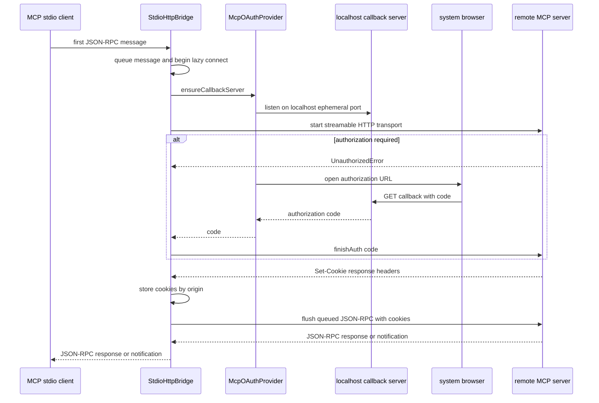

CodeMie has two complementary integration paths:

- **MCP relay**: `codemie-mcp-proxy` is a deliberately small stdio process for a client such as Claude Code. It relays JSON-RPC to one remote streamable-HTTP MCP server and performs browser OAuth when that server challenges the connection.
- **Managed local-proxy clients**: `codemie proxy connect` starts or reuses one local CodeMie gateway daemon, then writes client-specific configuration for Claude Desktop, VS Code, the VS Code Claude Code extension, or Codex Desktop.

These paths solve different problems. The MCP relay carries MCP traffic to a remote MCP endpoint; the managed clients send model traffic to the local CodeMie gateway. Claude Desktop is the overlap: its connector also receives an organization-managed MCP catalog and writes it into Desktop's `managedMcpServers` setting.

## MCP relay

### Entrypoints and installation

The package exposes `codemie-mcp-proxy`, backed by `bin/codemie-mcp-proxy.js`. The launcher validates its required URL, imports only the compiled bridge, starts it, and handles `SIGINT`/`SIGTERM`. It intentionally avoids the normal CLI initialization—migrations, update checks, and plugin loading—because any stdout output would corrupt the JSON-RPC stdio channel. Boot diagnostics go to `~/.codemie/logs/mcp-proxy.log`; user-facing errors use stderr.

Use the convenience command to register a server with Claude Code:

```sh
codemie mcp add <name> <url> --scope <scope>
```

It validates the URL and rejects a server name that starts with `-`, verifies that both `codemie-mcp-proxy` and `claude` are installed, then executes the equivalent Claude CLI registration with `codemie-mcp-proxy <url>` after `--`. The scope is forwarded only when supplied. Alternatively, the general CLI command is:

```sh
codemie mcp-proxy <url>
```

### Lazy connection, OAuth, cookies, and forwarding

`StdioHttpBridge` starts its `StdioServerTransport` immediately, but does not create the streamable HTTP transport until the first JSON-RPC message. Messages arriving during this one connection attempt are queued. Once connected, subsequent stdio messages are sent directly to HTTP; inbound HTTP messages are sent back over stdio.



This sequence shows the first-message connection, optional OAuth authorization, per-origin cookie capture, and bidirectional JSON-RPC forwarding.

The bridge creates a cookie-aware `fetch` for the HTTP transport because Node fetch does not retain response cookies itself. It captures individual `Set-Cookie` values as `name=value`, keyed by request origin, and supplies the matching origin's combined `Cookie` header on later requests. The jar is in memory, so it lasts only for the bridge process and is not shared across origins.

OAuth state is also session-only. Before HTTP startup, the provider starts a loopback callback server so that its dynamically registered client metadata already has a redirect URI. The provider advertises authorization-code and refresh-token grants with no token-endpoint client authentication, uses `MCP_CLIENT_NAME` when set (otherwise `CodeMie CLI`), and retains client registration, tokens, and PKCE verifier only in memory. On an authorization redirect it opens the platform browser; on Windows it uses PowerShell `Start-Process` so query parameters are not truncated by `cmd` parsing. If opening fails, the authorization URL is written to stderr for manual use.

The callback listener binds `localhost` on an OS-assigned port and accepts only `/callback`. It resolves once with `code` and optional `state`, returns a success page, and closes; an OAuth error, missing code, explicit close, or the default two-minute timeout rejects the pending authorization. Bridge shutdown disposes the callback server, terminates and closes HTTP if it exists, and closes stdio; the shutdown guard makes this idempotent. An HTTP transport close also initiates bridge shutdown. A non-auth connection failure while not shutting down exits the relay process, whereas individual failures while flushing queued messages are logged and do not retry that message unless the failure is `UnauthorizedError`.

### Relay observability and safe changes

Bridge diagnostics use `logger.debug()` and optional file logging enabled at module load by `MCP_PROXY_DEBUG=true`/`1` or `CODEMIE_DEBUG=true`/`1`. Since stdio is protocol data, do not add `console.log` to the relay. In credential-adjacent changes, use the project's error classes (for example, `ConfigurationError` or `ToolExecutionError`) at command boundaries, log through `logger.debug()`/the project logger, and pass structured log arguments through `sanitizeLogArgs()`. Never log OAuth codes, tokens, cookies, or gateway keys; log header presence, counts, names, or sanitized metadata instead.

## Managed proxy connection flow

`codemie proxy connect` accepts one or more target flags:

```sh
codemie proxy connect --claude-desktop
codemie proxy connect --vscode
codemie proxy connect --vscode-claude-code
codemie proxy connect --codex-desktop --model <slug>
```

`--profile`, `--force`, and `--verbose` apply to the connection; `--insiders` selects VS Code Insiders for either VS Code target. Calling `connect` with no target prints the target list without configuration changes. The legacy `codemie proxy connect desktop` and `codemie proxy connect vscode` commands still work but print a deprecation notice for `--claude-desktop` and `--vscode` respectively. `codemie proxy disconnect --codex-desktop` removes only the Codex integration.

Before starting a daemon, the orchestrator resolves an SSO-backed profile, verifies stored SSO credentials, and synchronizes registered and plugin skills on a best-effort basis. A Claude Desktop target additionally requires `codeMieUrl`, since that URL is used to fetch organization MCP servers. It derives a daemon identity from the target set: Claude Desktop and the VS Code Claude Code extension use the `claude-desktop` telemetry identity; VS Code BYOK uses `vscode-byok`; Codex uses `codex-desktop`.

Only one daemon serves a connect run. Its persisted state records process identity, local URL and port, profile, gateway key, upstream/provider/project metadata, client identity, and health fields. A running daemon is reused only if profile, port, project, optional provider/upstream URL, and effective client type match, and its deep health check passes. A mismatch, unhealthy daemon, or `--force` causes a stop and restart. Startup polls for readiness for up to five seconds. Stop sends `SIGTERM`, waits up to five seconds, then escalates to `SIGKILL` and clears state so a wedged process cannot block another connection.

Each requested configuration writer runs independently after the daemon is available. The command prints a per-target result summary, sets a nonzero exit code when any target fails, and rolls back a daemon it started only when all requested targets failed. Combining Codex Desktop with a higher-priority target is allowed but warned against: the shared daemon then lacks Codex model-name resolution, so Codex should be connected by itself.

### Claude Desktop: gateway settings and managed MCP catalog

The connector writes CodeMie inference settings into Claude Desktop's active `configLibrary/<UUID>.json`, registers that file through `_meta.json`, preserves unrelated configuration keys, and tells the user to restart the app. It discovers models through the local gateway's `/v1/llm_models?include_all=true`, filters to Claude models, and writes the curated compatible set (with at most one preferred Opus). A 5xx model-catalog failure falls back to the curated list; authorization, malformed response, no models, or no preferred match is a `ConfigurationError` rather than a silently incomplete configuration. On Linux, a present `/etc/claude-desktop/managed-settings.json` is surfaced as a warning because managed settings override the local configuration.

For managed MCPs, the connector fetches `GET /v1/mcp/managed-servers?client=claude-desktop` through the shared authenticated HTTP client. It distinguishes an authoritative empty array from failure: missing SSO credentials, transport or parse failure, non-2xx response, non-array body, or a non-empty response in which every entry is invalid returns `null`; only a successful empty catalog returns `[]`. That distinction prevents a transient server or contract failure from revoking previously written organization entries.

Canonical catalog entries are validated and mapped only when Desktop can represent them: valid names, URL, and `http` or `sse` transport. A structured OAuth object must include `clientId`, `authorizationUrl`, and `tokenUrl`; recognized optional fields are type-checked while unknown fields are retained for forward compatibility. The connector prefers a valid structured OAuth object over boolean and legacy auth shapes. When a structured Desktop OAuth configuration has no usable issuer, it adds the CodeMie default authorization-server list; boolean discovery-based OAuth is left unchanged.

The final Desktop MCP list reconciles bundled defaults, organization entries, and existing user entries. Backend entries win collisions by name or endpoint, and user entries not owned by CodeMie are preserved. Ownership is recorded in `~/.codemie/proxy/desktop-managed-mcp-state.json` (under the CodeMie home) as managed names. On a successful catalog fetch, the marker is atomically written with the union of old and new names *before* the Desktop config, then narrowed to the exact durable set afterward. On a failed fetch it neither revokes previously managed organization entries nor updates the marker; it seeds only non-conflicting defaults when the stored list is readable.

### VS Code targets

`--vscode` writes or reconciles a `CodeMie` `customendpoint` provider in `User/chatLanguageModels.json` (stable or Insiders platform data directory). It replaces duplicate managed providers with one, preserves other providers and existing model-provider settings, and populates the supported model catalog with the local gateway's appropriate `/v1/chat/completions`, `/v1/messages`, or `/v1/responses` endpoint and capabilities. The writer preserves an existing VS Code secret reference for the API key. If none exists, it deliberately omits a literal key and reports that the user must set it in **Chat: Manage Language Models**. Invalid JSON or an unexpected root shape produces a `ConfigurationError` without changing the file; writes are atomic and preserve existing file mode where possible.

`--vscode-claude-code` writes the bundled Claude Code extension's `User/settings.json`. It sets `claudeCode.disableLoginPrompt` and upserts only `ANTHROPIC_BASE_URL` and `ANTHROPIC_AUTH_TOKEN` in `claudeCode.environmentVariables`, preserving unrelated settings and environment variables while deduplicating existing names. It requires the target VS Code user-data directory to exist rather than creating an unused edition directory, and uses the same atomic writer.

### Codex Desktop

`--codex-desktop` integrates with Codex in the ChatGPT desktop app solely by editing the configuration it shares with the Codex CLI: `$CODEX_HOME/config.toml` when `CODEX_HOME` is set, otherwise `~/.codex/config.toml`. The connector checks common macOS/Windows ChatGPT locations unless `--force` is given; other platforms require `--force` to write anyway. Before writing, it discovers and ranks Codex-compatible models through the local proxy with a 15-second bound, so an unreachable or incompatible proxy fails before the user config is touched. `--model` is validated against the same deployment-resolution rule used by the proxy; otherwise the newest ranked model is selected.

The connector validates existing TOML and refuses to replace another active `model_provider` without `--force`. It avoids a TOML serialize/round trip that would lose comments and ordering. Instead, it splices two sentinel-delimited regions: root `model_provider`/`model` settings are prepended before TOML tables, and `[model_providers.codemie]` with `wire_api = "responses"` and the bearer header is appended. It comments out displaced root keys so they can be restored. A pre-managed backup is made once, ownership state is atomically written before the config, and the final generated TOML is parsed before an atomic write.

Disconnect first removes those two marked regions and restores displaced keys, preserving edits made elsewhere while connected. If the result cannot parse or still selects the CodeMie provider—for example, damaged sentinels—it restores the pre-connect backup when available; otherwise it raises `ConfigurationError` and asks for manual removal instead of claiming success while a bearer credential remains.

## Focused verification

The MCP unit tests use mocked MCP transports to verify lazy construction, queued-first-message flushing, stdio-to-HTTP and HTTP-to-stdio routing, idempotent shutdown, and per-origin cookie injection after `Set-Cookie`. OAuth tests exercise a real ephemeral loopback listener for successful, error, missing-code, timeout, and close paths, while mocking browser launch and checking in-memory provider state.

Connector tests cover strict daemon reuse/restart and partial-failure semantics; managed catalog validation and `null` versus `[]` failure behavior; Desktop model and MCP reconciliation; VS Code provider/settings preservation and atomic-write errors; and Codex managed-block connect/disconnect round trips using a temporary `CODEX_HOME`. Run the repository's unit suite with:

```sh
npm run test:unit
```

When changing any credential-bearing configuration path, add a test that inspects logged arguments and confirms the raw gateway key, token, cookie, or authorization code is absent.
