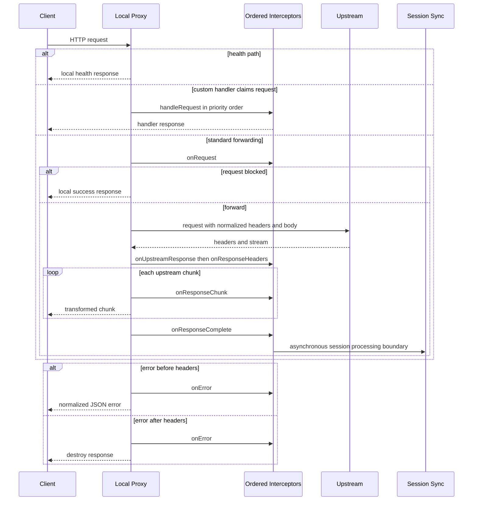

## Provider plugins are declarative integration points

The provider subsystem separates provider metadata from the setup, health, model-discovery, environment-export, and agent-lifecycle behavior that may accompany it. A `ProviderTemplate` identifies a provider, its default endpoint and authentication type, recommended models, capabilities, streaming and local-install support, and optional `exportEnvVars` and `agentHooks`. Capabilities are descriptive feature flags such as `streaming`, `tools`, `vision`, `embeddings`, `model-management`, `function-calling`, and `sso-auth`; consumers should use the registered template rather than duplicating provider-specific decisions.

`registerProvider(template)` inserts the template into the process-wide `ProviderRegistry`. Importing `src/providers/index.ts` imports every built-in provider package for this side effect, then exports the registry and provider namespaces. The registry also independently holds health checks, model fetchers, and setup steps. Health-check and model-fetcher lookup uses each implementation's `supports(provider)` predicate, whereas setup steps are keyed by provider name. This makes a provider extension more than a template when it needs interactive setup or discovery, without putting provider-specific branches in the central registry.

| Built-in provider | Authentication and routing implication | Representative declared capabilities |
| --- | --- | --- |
| `ai-run-sso` | SSO; requires an integration header when an integration is configured | streaming, tools, function calling, embeddings, SSO |
| `bearer-auth` | JWT bearer token supplied at runtime; hidden from interactive setup | streaming, tools, function calling |
| `ollama` | No authentication; local runtime with model installation | streaming, tools, embeddings, model management |
| `litellm` | API-key gateway | streaming, tools, function calling |
| `bedrock` | API-key typed configuration backed by AWS credentials | streaming, tools, function calling, vision |
| `anthropic-subscription` | No proxy authentication; Claude Code uses its native stored subscription login | streaming, tools, function calling, vision |
| `moonshot-subscription` | No proxy authentication; Kimi Code uses its native stored subscription login | streaming, tools, function calling, vision |

The last two are especially important boundaries: `authType: 'none'` prevents a stale `CODEMIE_AUTH_METHOD=jwt` from causing model traffic to be proxied. Their agent hooks clear explicit provider API/proxy variables so the native CLI login remains authoritative; they can still install/inject local lifecycle hooks for telemetry-related artifacts without routing model traffic through CodeMie.

## SSO, JWT, and default-provider paths

The SSO template is the highest-priority visible provider and exports `CODEMIE_URL`, project, auth method, optional integration ID, and—when configured for JWT—the resolved JWT token. Browser SSO starts an ephemeral local callback server, opens `${ensureApiBase(codeMieUrl)}/v1/auth/login/<port>`, waits with timeout and cancellation support, validates the callback payload, and stores cookies plus the resolved API URL. Credential expiry comes from the access-token JWT `exp` when decodable, otherwise a 24-hour fallback is used. Stored SSO credentials are URL-scoped (with a backward-compatible global fallback only if its normalized origin matches) and expired credentials are cleared.

The proxy chooses authentication at startup:

- **JWT:** `config.jwtToken`, then `CODEMIE_JWT_TOKEN`, then credentials stored for `targetApiUrl`. Absence is an `AuthenticationError`. The JWT interceptor rejects a known-expired credential and injects `Authorization: Bearer ...`.
- **SSO/default:** `authMethod` defaults to SSO. Only a provider whose registered `authType` is `sso` triggers stored-credential lookup for `targetApiUrl`; lack of matching credentials is an `AuthenticationError`. The SSO interceptor validates cookie names and values for unsafe header characters, drops invalid entries, and injects the remaining cookie header. If none remain, it fails authentication.
- **No-auth providers:** `BaseAgentAdapter` does not start the proxy for `authType: 'none'`, before it considers the JWT environment setting. For proxy-capable agents, SSO providers or `CODEMIE_AUTH_METHOD=jwt` select the proxy; after startup the adapter changes the child environment to the local URL and uses `proxy-handled` as its API-key placeholder.

Credential storage is owned by `CredentialStore`, not by the proxy. It uses the system keychain where available and an encrypted, machine-specific AES-256-CBC file fallback. Keep this ownership boundary: the proxy loads credentials and injects them into upstream requests, but should neither persist them nor expose them in logs.

## Startup and lifecycle

`CodeMieProxy` is the local HTTP server used by agent adapters and the detached `codemie proxy start` daemon. It builds one `PluginContext`, initializes enabled proxy plugins in ascending priority, then binds to `host` (default `localhost`) and either the configured port or an available port. Once bound it writes the actual port into its configuration and runs `onProxyStart`; this ordering lets lifecycle integrations use the final gateway URL. `/health` and `/healthz` are deliberately pre-auth liveness probes and return the port and start time without invoking plugins or the upstream.

The daemon explicitly binds `127.0.0.1` for desktop gateway compatibility, persists its state after startup, and on restart pins the previous actual port. A pinned port retries `EADDRINUSE` five times rather than silently changing the desktop's configured URL; an unpinned initial bind may fall back to a system-assigned port. Shutdown runs plugin stop hooks, force-closes keep-alive connections, closes the server, and destroys the HTTP agents.

`ProxyHTTPClient` uses keep-alive agents, honours `HTTP_PROXY`/`HTTPS_PROXY`, and bypasses them according to `NO_PROXY`/`no_proxy` plus `noproxy`/`no-proxy` entries in `~/.npmrc` (host, domain, port, IPv4 CIDR, or `*`). Its normal `forward` operation returns the upstream `IncomingMessage` stream; it does not buffer the response. A request body is read as a `Buffer` before interception to preserve byte integrity. Response buffering is an explicit exceptional facility for an `onUpstreamResponse` interceptor that needs to inspect and retry a response.

## Ordered interception and streaming

The proxy core owns only context creation, HTTP forwarding, response streaming, and lifecycle/error orchestration. Cross-cutting policy belongs in interceptors. Plugins register in any order, but the registry initializes enabled plugins sorted by ascending effective priority; initialization failures are logged and do not prevent other plugins from loading. A plugin can supply startup/shutdown, request, upstream-response, response-header, per-chunk, completion, and error hooks. `handleRequest` is an intentional escape hatch for traffic with a fundamentally different destination: if it returns `true`, it owns the response and the normal pipeline is entirely skipped.

This sequence shows the normal streaming path and the paths that intentionally bypass it.

The core plugin registration establishes these material ordering constraints:

1. MCP authorization relay (priority 3) is first; it custom-routes MCP OAuth traffic. It validates public origins—including DNS resolution and per-flow root/relay association—and restricts buffering to bounded auth metadata. Because it claims a request, standard LLM interceptors do not protect it; the MCP handler owns its SSRF, authentication, and logging protections.
2. Endpoint blocking (5) marks known telemetry and managed-settings paths as blocked before auth; the core responds locally with `200` to avoid client retries. Gateway-key authentication (7) checks the incoming local bearer key when configured, emits a `401` on mismatch, and strips a successful gateway authorization header before upstream authentication runs.
3. SSO and JWT authentication (10) are mutually exclusive no-op/active alternatives. Client-specific normalizers (14), the request sanitizer (15), encrypted-content retry sanitizers (16), and VS Code normalization (17) modify compatibility details before header injection (20). The header plugin adds request/session correlation, CLI/client/model/project/repository/branch metadata, and an integration header only when the provider declares `customProperties.requiresIntegration`.
4. Logging (50) and SSO session sync (100) run after request policy. Chunk hooks may transform or suppress a chunk; a chunk-hook failure is logged and streaming continues. Other hook failures are also isolated so one optional integration does not terminate forwarding.

Normalization is deliberately scoped by client and endpoint rather than globally rewriting arbitrary API traffic. For `codemie-code` and `codemie-opencode`, JSON chat-completions requests have reasoning fields removed; on a `/responses` path, `reasoning.effort` is retained while unsupported summary variants are removed. When a body changes, the interceptor rebuilds the buffer and updates `content-length`. Other normalizers adapt Claude thinking/sampling, cap Kimi output tokens, resolve Codex desktop model aliases and repair empty tool descriptions, and constrain VS Code identifiers. These are compatibility plugins, not duties for the forwarding core.

## Errors, observability, and safe extension

Errors from custom handling or the standard pipeline reach `onError`. Client aborts are treated as normal disconnects and do not get an error response. Otherwise the proxy normalizes failures with its proxy error classes: it sends a structured JSON error before headers are sent, or destroys an already-started response. `NetworkError` and `TimeoutError` are operational failures logged with `logger.debug()` to avoid production noise; startup credential failures use `AuthenticationError` and missing sync prerequisites use `ConfigurationError`.

When adding a plugin, give it a stable ID and explicit priority, keep its state in the interceptor instance (not global request state), and decide whether it is request-local, stream-aware, or lifecycle-owned. Never add analytics or provider policy to `CodeMieProxy`; use a hook. Avoid buffering a stream unless the feature specifically needs it, and bound any buffered input. For credentials, authorization headers, cookies, gateway keys, tokens, or errors that might embed them, log only safe facts or pass structured arguments through `sanitizeLogArgs()`; the gateway-key plugin demonstrates this. Prefer `logger.debug()` for diagnostic detail and project error classes for expected failures.

## Session synchronization boundary

`SSOSessionSyncPlugin` is an optional, SSO-only lifecycle integration—not part of the request forwarding contract. It is enabled only when a session ID, client type, and SSO credentials exist, and when `CODEMIE_SESSION_SYNC_ENABLED` (highest precedence) or `profileConfig.session.sync.enabled` permits it; it defaults enabled in this eligible SSO case. It may use separately loaded credentials for `syncCodeMieUrl`, allowing sync authentication to be distinct from target API authentication. A missing sync credential logs a diagnostic but does not prevent the proxy from starting.

The plugin constructs a `SessionSyncer` processing context and synchronizes discovered local session data on a timer (default `120000` ms, configurable by `CODEMIE_SESSION_SYNC_INTERVAL`) and once more during proxy shutdown. `CODEMIE_SESSION_DRY_RUN` or profile configuration controls dry-run mode, with environment taking precedence. Concurrent runs are suppressed. The sync API base is explicit `syncApiUrl` when provided; otherwise, after the final port is known, it uses the local proxy URL so the sync call follows the same session-lifecycle path. Thus model-response completion and periodic/final artifact synchronization are related operationally, but sync is not allowed to buffer or delay the model stream.

## Focused verification

- Run `npm run test:integration -- proxy-normalizer-body-contract` to exercise a real in-process proxy against a mock upstream and assert the transformed body that reaches it for request sanitizer, Claude, Kimi, and Codex cases.
- Run `npm run test:integration -- proxy-daemon-lifecycle` after `npm run build` to verify detached daemon startup, state persistence, pre-auth health, SIGTERM shutdown, and state cleanup using a dummy JWT.
- Protect routing behavior with the no-auth/stale-JWT regression test in `tests/integration/proxy-routing-guard.test.ts`: native subscription providers must not start the proxy, while SSO and bearer-auth paths remain proxy-capable.
