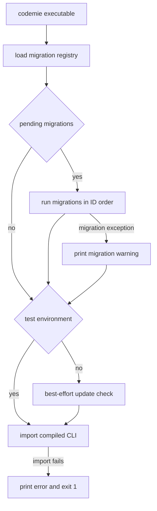
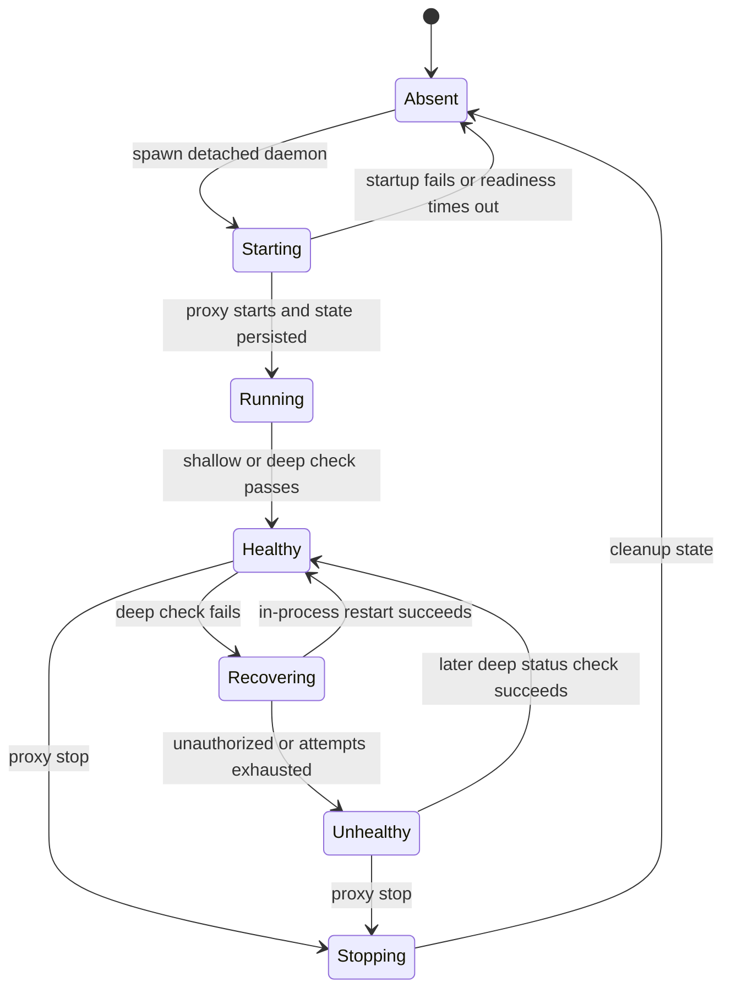

The CLI has deliberately different failure contracts for its startup conveniences and for an explicitly requested operation. Startup migrations and background update checks must not prevent the requested CLI command from loading. In contrast, `codemie self-update` and `codemie proxy start` report failure to the user and exit unsuccessfully when their requested work cannot be completed.

## Startup wrapper: best-effort maintenance before the CLI

`bin/codemie.js` is the executable wrapper. Before dynamically importing the compiled CLI it:

1. imports the migration API, whose module imports all registered migrations;
2. checks for pending migrations and runs them with user-visible progress;
3. except in `NODE_ENV=test` or `VITEST=true`, performs the update check; and
4. dynamically imports `dist/cli/index.js`.

A migration exception becomes a warning and update-check exceptions are suppressed at this wrapper boundary; neither prevents normal CLI initialization. Failure to import the actual CLI is different: it prints an error and exits with code 1.

This shows the non-blocking startup migration and update paths.

### Migration tracking is the idempotency boundary

Migrations self-register when imported by `src/migrations/index.ts`; the registry returns them sorted lexically by ID. `MigrationTracker` stores history at `getCodemiePath('migrations.json')`, normally `~/.codemie/migrations.json` but under `CODEMIE_HOME` when that environment variable is set. Missing or invalid history is treated as an empty version-1 history, so migrations are selected solely by whether their ID has a successful record.

`MigrationRunner.runPending()` executes every currently pending migration in that sorted order and continues after an individual failure. A successful migration is recorded whether it changed state (`migrated: true`) or is an applicable no-op (`migrated: false`); a `success: false` result or thrown error is counted as failed but **is not recorded**. It therefore remains pending for retry on a later CLI startup. `dryRun` executes the logic without writing any records.

**Safe migration change rules**

- Give a new migration a unique, ordered ID, implement `up(): Promise<MigrationResult>`, and import it from `src/migrations/index.ts`; do not reorder or silently repurpose an existing ID.
- Make `up()` safe to retry. A process can make a partial local change and then fail before its success record is written.
- Return `{ success: true, migrated: false, reason }` only when it is safe to permanently mark the migration complete. Returning failure is the retry mechanism.
- Do not convert the wrapper’s migration catch into a fatal startup path. This would violate the availability contract for every CLI command.
- Test orchestration separately from data transformation: the migration ordering tests cover sorted execution, history-backed no-ops, dry runs, and continuation/retry after failures.

## Proxy daemon ownership and state

`codemie proxy start` loads the selected profile, verifies an API URL and SSO credentials, then asks `spawnDaemon()` to start a detached Node subprocess through `bin/proxy-daemon.js`. The JavaScript launcher imports the compiled daemon and treats import failure as fatal. The daemon requires `--target-url` and `--state-file`, validates a positive optional port, and binds the proxy explicitly to `127.0.0.1` rather than `localhost`.

The manager’s default state file is `${CODEMIE_HOME:-~/.codemie}/proxy-daemon.json`. Its state identifies the process and local gateway (`pid`, `port`, `url`, `profile`, `gatewayKey`, `startedAt`) and may carry client/project/telemetry metadata and watcher health fields. Both the manager writer and daemon persistence use write-to-`.tmp` then rename, avoiding a partially written JSON file for readers. A state file alone is not liveness: `checkStatus()` probes its PID and deletes stale state when the process is gone.

`spawnDaemon()` passes endpoint, provider, profile, gateway key, state path, and optional client, project, telemetry and sync context as arguments, then polls state and PID every 100 ms for up to five seconds. If readiness never appears it throws `ToolExecutionError` with the log directory as the remediation location. `proxy start` is idempotent only for a live daemon that matches the requested profile, port, project, client type, provider, and target URL; a live mismatch is a `ConfigurationError` directing the operator to stop it first. The client connection orchestrator can instead stop and replace a mismatch, forced daemon, or deeply unhealthy daemon before configuration is written.

This shows the daemon process, watcher, and operator-visible state lifecycle.

### Shutdown, health, and recovery

`stopDaemon()` sends `SIGTERM`, waits up to five seconds, then escalates to `SIGKILL` for a wedged process and always clears state. The daemon handles both `SIGTERM` and `SIGINT`: it stops the watcher, attempts to stop telemetry and the proxy, unlinks state, and exits. Preserve this cleanup ordering whenever adding a long-lived daemon resource.

Health checks never throw; they return a typed result. A shallow check calls unauthenticated `GET /health` with a 1.5-second deadline, establishing only that the local listener responds. A deep check additionally calls `GET /v1/llm_models?include_all=true` with `Authorization: Bearer <gatewayKey>` and a six-second deadline. A 401, 403, or non-JSON response is classified as `unauthorized` (expired SSO); other non-success or transport failures become `upstream-error`, while a failed shallow check is `dead-socket`.

`codemie proxy status` uses shallow health by default and adds the upstream/auth probe with `--deep`; `--json` emits `stopped`, `healthy`, or `unhealthy` plus connection metadata and a reason when unhealthy. A successful deep human-readable status can clear a stale persisted watcher issue. Do not describe a shallow result as proof that credentials or the upstream are usable.

Inside the daemon, `ProxyWatcher` runs an unref’d deep check every 30 seconds. It detects an unusually large timer gap as a likely sleep/wake event and checks immediately on that tick. A healthy result resets the restart counter and updates `lastHealthyAt`. For a recoverable failure it waits exponential backoff (1 s, 2 s, 4 s, capped by the interval) and reconstructs the proxy **in process** on the actual port selected at initial startup; the port is pinned so configured desktop URLs remain valid. It gives up and persists `health: 'unhealthy'` immediately for expired SSO, or after three failed recovery attempts, rather than looping indefinitely. Reauthentication is an operator action: run `codemie profile login` and restart the proxy.

## Updates and diagnostics

The automatic updater checks npm for `@codemieai/code` with a five-second version lookup, validates both current and received semantic versions, and rate-limits checks using `${CODEMIE_HOME}/.last-update-check` (24 hours by default, configurable with `CODEMIE_UPDATE_CHECK_INTERVAL`). It records a check even when no update is available or lookup returns no result. `${CODEMIE_HOME}/.update-lock` is opened exclusively to ensure only one CLI process installs at a time.

`CODEMIE_AUTO_UPDATE` defaults to enabled (`true`, `1`, or `yes`): an available update is installed silently and takes effect on the next command. Set `CODEMIE_AUTO_UPDATE=false` for an interactive prompt instead. `codemie self-update --check` only reports availability; without `--check`, `codemie self-update` installs visibly. Unlike background checking, this explicit command exits 1 when it cannot check or install.

`codemie doctor` is a diagnostics orchestrator, not a proxy-health command. It runs Node, npm, Python, uv, AWS CLI, active-profile configuration, JWT auth, agents, workflows, and frameworks checks, displaying results as they arrive. After the active-profile check, it asks `ProviderRegistry` for a provider-specific check and bounds that call to 15 seconds. `codemie doctor --verbose` enables `CODEMIE_DEBUG`, prints the debug-log location, and records system and sanitized environment information; diagnostic failures are represented in the summary rather than crashing the command.

## Logging and error-handling requirements for operational changes

Use the project’s error vocabulary at command boundaries: `ConfigurationError` for invalid/missing operator configuration and `ToolExecutionError` for an attempted external operation such as daemon startup. Use `getErrorMessage()` when rendering an unknown caught error. This keeps CLI failure messages actionable without assuming every thrown value is an `Error`.

For diagnostic detail, use `logger.debug()` rather than ordinary terminal output. Debug console output is gated by `CODEMIE_DEBUG`, while the logger’s file output is under `${CODEMIE_HOME}/logs/debug-YYYY-MM-DD.log`, rotates across dates, and retains five days. Never pass raw credential-adjacent objects, headers, tokens, cookies, gateway keys, or URLs with embedded credentials to logging. Call `sanitizeLogArgs()` at the call site for such arguments; it redacts recognized sensitive keys and token-like values before the logger receives them. This matters especially in spawn, health, recovery, and provider-error paths.

## Focused verification

Use isolated `CODEMIE_HOME` before importing modules that compute a module-level state/history path. Relevant coverage includes:

- `src/migrations/__tests__/migration-runner-ordering.test.ts` for ordered registration, persistence, dry run, and failure retry semantics;
- proxy daemon manager and health-check unit tests for atomic state behavior, stale PID cleanup, readiness arguments, typed shallow/deep outcomes, and authorization classification;
- `src/cli/commands/proxy/__tests__/watcher.test.ts` for restart limits, immediate unauthorized give-up, recovery counter reset, and stop behavior;
- `tests/integration/proxy-daemon-lifecycle.test.ts` for the real detached compiled daemon, state readiness, local `/health`, and SIGTERM shutdown cleanup; it uses a temporary home and dummy JWT path so no real credentials are required; and
- doctor integration tests, including Windows-oriented tool detection, to keep diagnostics non-crashing and cross-platform.

When changing a startup wrapper, test both the best-effort failure path and the fatal CLI-import path. When changing daemon state, preserve backward-compatible optional health metadata and test state cleanup after both graceful and forced termination. When changing health behavior, test timeouts/classification and the distinction between local liveness and authenticated upstream reachability.
