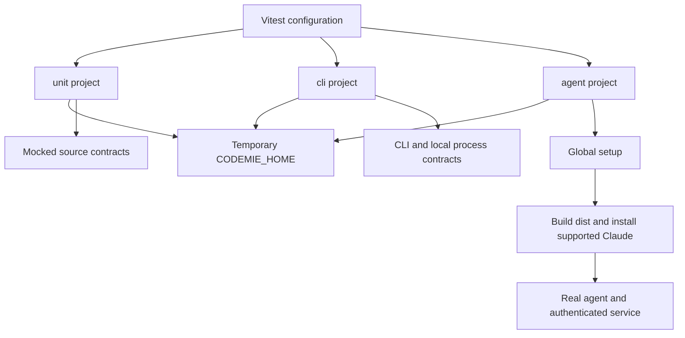
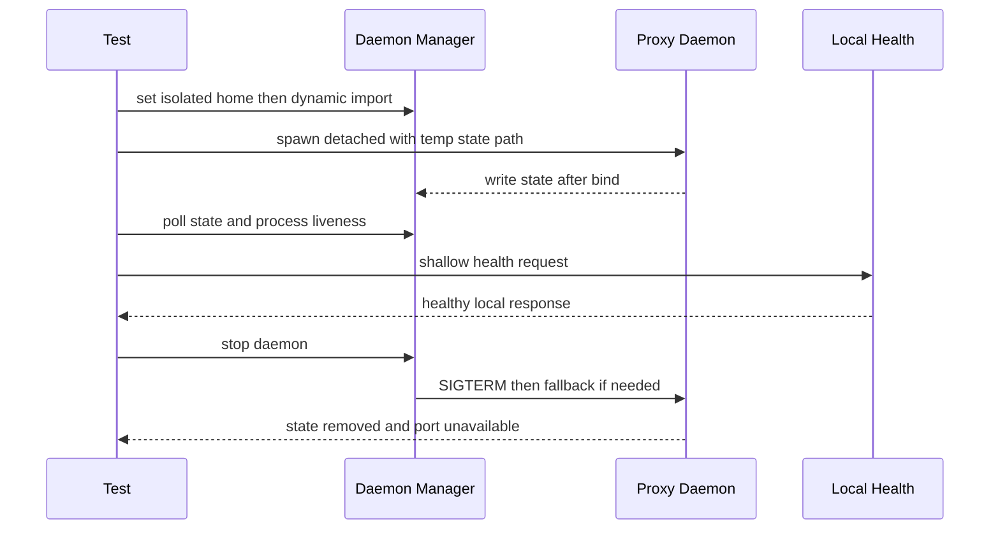

# Test Projects, Isolation, and High-Risk Contracts

CodeMie uses Vitest projects to make the cost and dependencies of a test explicit. Co-located unit tests exercise source-level behavior with mocks where an external boundary would distract from the contract. The CLI project executes command and local-server integration paths without network authentication. The agent project is deliberately the networked tier: it builds the distribution, establishes the required authentication mode, and launches real supported agent binaries.

This is not an instruction to run the suites as part of documentation work. Repository policy is to write or run tests only when the user explicitly requests it. When tests are requested, use the configured Vitest projects and preserve `CODEMIE_HOME` isolation rather than substituting an ad hoc command or a developer's real home.

## Project boundaries and entrypoints

| Project | Selection | Intended boundary | Key execution constraints |
| --- | --- | --- | --- |
| `unit` | `src/**/*.test.ts` and `src/**/*.spec.ts` | Source logic, registries, adapter decisions, parsers, and plugin behavior | Node environment, isolated files, 30-second test and hook timeouts, V8 coverage configuration. |
| `cli` | `tests/integration/**/*.test.ts`, excluding `agent-*.test.ts` | Built CLI commands, local filesystem/process behavior, and deterministic local HTTP integration | Node environment, isolated files, group order 1, no network authentication requirement. |
| `agent` | `tests/integration/agent-*.test.ts` | A real built distribution, supported agent CLI, authentication, proxy, hooks, and session artifacts | Global build/setup, isolated files, group order 2, 180-second test timeout, 300-second hook timeout, and up to two workers by default or `CI_AGENT_MAX_WORKERS`. |

The package scripts expose these projects as `npm run test:unit`, `npm run test:integration` (the `cli` project), and `npm run test:integration:agent`; `test:run` selects unit plus CLI, while `test:all` runs all three serially by project. The ordinary CI script builds before its unit and CLI tests. Agent setup itself also builds once per Vitest session because its tests execute `bin/...` entry points against `dist/`.

All three projects set `NODE_ENV=test`, `FORCE_COLOR=1`, and `CODEMIE_HOME` to a temp directory named with the config evaluation process ID. The PID component prevents simultaneous `vitest run` invocations from sharing logs or configuration state. Vitest's `isolate: true` protects test-file module environments, but it does not make filesystem paths, spawned processes, fixed ports, or a mutated `process.env` safe by itself; suites that own those resources must allocate and clean them explicitly.

This shows dependency escalation: a test should stay in the lowest tier that can prove its contract, with agent tests reserved for behavior that requires an actual distribution, agent executable, credentials, or remote service.

## Isolation is a correctness requirement

`CODEMIE_HOME` relocates the configuration, credentials, sessions, logs, and daemon state described in [Profiles, Configuration Precedence, and Local State](../concepts/configuration-and-local-state.md). Tests must never accidentally read or modify `~/.codemie`. The config-level environment value is a baseline, but a suite needing a distinct profile, daemon state file, or session directory should create a unique temporary home, pass it to spawned children, and remove it in teardown.

`TempWorkspace` supplies throwaway working directories with file, JSON, config, and minimal Git-repository helpers. It is appropriate when the test needs a repository-shaped current directory, but it is separate from the CodeMie home: use both when a child reads its profile from `CODEMIE_HOME` and operates in a workspace. `resolveLongPath()` and `getTempDir()` handle Windows short-path behavior so paths passed as a child `cwd` compare consistently.

The reusable `setupTestIsolation()` helper captures the incoming `CODEMIE_HOME`, assigns a temporary home before a suite, restores the prior value afterward, and deletes the temporary tree unless debugging opts out. Cleanup should use `afterEach`, `afterAll`, or `finally` according to resource lifetime. It must also close local servers, stop proxies, reap spawned PIDs, and restore every changed environment variable; removing a directory alone cannot clean a detached listener.

Agent subprocesses use a stronger boundary. `jwtCleanEnv()` is an allowlist environment that removes ambient credentials and `CODEMIE_*` state; `ssoCleanEnv()` removes `CODEMIE_*` and CI CodeMie variables while retaining the platform/keychain/network environment needed by SSO. Both remove `node_modules/.bin` from `PATH` so a local dependency shim cannot shadow the globally linked `codemie` hook command. The agent smoke harness writes a per-test SSO profile, copies locally decryptable SSO credential files, initializes a Git workspace for agents that require trust, and invokes the local `bin` entry point with that home.

## Import timing and global registries

Module initialization is observable behavior when a module derives a default path from the environment or registers a singleton. Set environment variables and install mocks **before** importing such a module. If a test needs a fresh module-level registry or cached configuration, use `vi.resetModules()` and then dynamically `await import(...)`; reset/restore mocks and environment state afterward.

The detached-daemon lifecycle test is the canonical example: it creates and exports its temporary `CODEMIE_HOME` before dynamically importing `daemon-manager`, because that module computes `DEFAULT_STATE_FILE` during module evaluation. Importing first would bind the manager to the developer/default home and invalidate both the test's isolation and its cleanup assumptions. The desktop connector tests likewise reset modules around `CODEX_HOME` changes. Proxy plugin registration is also singleton state: tests which manually assemble a pipeline reset the plugin registry before and after each case, while the ordinary proxy import auto-registers the core plugins.

## What the focused tests protect

### Configuration, registry, and launch decisions

Unit tests protect the extension boundary rather than merely checking a class exists. The agent-registry suite asserts the complete expected built-in/agent-plugin membership, unique names, retrievability, and the adapter operations consumers rely on. This catches a missing registration or an accidental analytics-only agent behavior change at the CLI discovery boundary.

`BaseAgentAdapter` tests cover the decisions that can silently route traffic incorrectly: an analytics-sync URL alone must not enable the model proxy; an `authType: 'none'` provider must remain direct even if a stale `CODEMIE_AUTH_METHOD=jwt` is inherited; and proxy-capable SSO/JWT configurations do enable the proxy. They also pin valid `sso`/`jwt` proxy auth-method mapping, safe handling of unknown/manual values, reasoning-effort injection, Windows command quoting, and dry-run behavior—including stopping an already-created proxy before returning so the command cannot hang. See [Agent Plugin System](../integrations/agent-plugin-system.md) for the runtime extension model.

### Proxy security, ordering, and lifecycle

The local proxy is an ordered interceptor pipeline, not an unordered set of extensions. Registration order is intentionally immaterial; the registry initializes enabled plugins in ascending priority. The production core positions endpoint blocking before gateway-key validation, validates and strips the local gateway credential before SSO/JWT upstream authentication, performs request normalization/sanitization before header injection, and places session synchronization late in the lifecycle. The header contract integration test makes this ordering observable against a mock upstream: a valid local gateway key never leaves the machine, the upstream receives the real JWT authorization and CodeMie context headers, and an invalid gateway key produces `401` without an upstream request.

The daemon lifecycle test complements mocks by starting the real detached `bin/proxy-daemon.js` process with a dummy JWT and a local `/health` probe. It verifies state-file persistence and readiness, running status, pre-auth shallow health, SIGTERM shutdown, state deletion, process reaping, and loss of service after stop. The dummy token is sufficient because `/health` is local and does not call an upstream gateway; it keeps the test credential-free while proving the release-critical detached-process path. See [Provider Plugins, SSO, and the Streaming Local Proxy](../integrations/provider-plugins-and-local-proxy.md) and [Daemon Migrations and Diagnostics](../operations/daemon-migrations-and-diagnostics.md) for the corresponding runtime and operations behavior.

This is the detached daemon contract exercised without a real upstream credential.

### Session artifacts and synchronization

The networked task/session test executes the branch's `codemie-claude` entry point with a UUID-bearing file-generation task. In JWT mode it creates a temporary home and bearer profile; in local SSO mode it uses the SSO autotest profile and restores the user's previously active profile afterward. It asserts process success, actual generated work, and eventual hook-produced session files rather than assuming they exist at process exit. A poll waits for the post-exit rename/synchronization boundary, then validates the completed session JSON and its conversation and metrics JSONL records against schemas, their IDs, and the UUID-correlated user and assistant content. In SSO mode it additionally requires a conversation sync attempt, conversation ID, timestamps, and synced metrics.

`SessionSyncer` integration tests use a mocked metrics sender to test persistence and failure semantics deterministically: pending JSONL deltas become aggregated metrics sent to `/v1/metrics`; successful records become `synced` with an attempt count and timestamp; already-synced input is not resent; and processor failures leave work pending for a later attempt without necessarily failing the overall multi-processor sync result. This preserves the distinction between artifact durability and best-effort remote synchronization.

### Desktop and editor compatibility

Desktop integrations combine generated configuration with a gateway that must correctly interpret client-specific traffic. The Codex desktop connector tests use temporary workspaces and dynamic imports to verify `CODEX_HOME` path resolution, unmanaged-config backup behavior, preservation of unrelated TOML, model discovery/filtering, requested-model rejection, and the ordering that writes ownership marker state before modifying user configuration.

The VS Code BYOK integration suite starts real in-process proxy and upstream HTTP servers, writes `chatLanguageModels.json` into a temporary VS Code-style `User` directory, and tests every supported model and reasoning-effort combination. It verifies that model selection comes from the supported matrix rather than the active profile model, each request reaches the correct endpoint with CodeMie client/project context but without its local authorization key, and Responses traffic receives the required `user` normalization. The normalizer's unit tests additionally guarantee it applies only to `vscode-byok`, preserves valid short identifiers, deterministically hashes overlength identifiers without logging them, and updates `content-length` after body changes. A recovery test preserves encrypted reasoning state while upstream affinity is healthy, then confirms that a rejected replay is surfaced for that request and subsequent requests remove the invalid state and succeed. See [MCP and Desktop Clients](../integrations/mcp-and-desktop-clients.md) for the user-facing integration contract.

## Selecting and maintaining tests

Choose the smallest configured project that can demonstrate the risk:

- use a unit test for deterministic mapping, validation, error handling, registry membership, plugin scoping, and module-local policy;
- use the CLI project for real command entry points, local proxy/server behavior, process lifecycle, persisted files, or generated desktop configuration without a live authenticated service; and
- use the agent project only for real agent execution, SSO/JWT behavior, extension hooks, or externally synchronized session artifacts.

For changes involving config paths, module initialization, credentials, a registry, a daemon, or a desktop client, state the isolation and teardown plan in the test. For proxy changes, test both the allowed upstream view and the rejection/no-forwarding path; header names, stripping, body rewriting, and plugin priority are compatibility/security contracts. For asynchronous session work, poll a bounded time for durable artifacts and validate their schema and correlation rather than making timing-sensitive fixed sleeps. These focused checks provide stronger release protection than broad implementation-coupled assertions.
