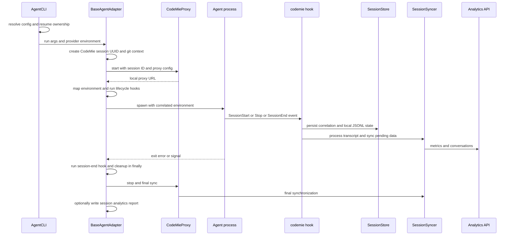

# Agent Launch, Sessions, Analytics, and Cleanup

A managed `codemie-<agent>` invocation has one CodeMie session identity for its lifetime. `BaseAgentAdapter.run()` generates that UUID before proxy setup, puts it in `CODEMIE_SESSION_ID`, initializes logger context, and carries it into proxy configuration, child environment, hook invocations, local session files, and later synchronization. Repository and branch are detected once at launch and propagated in `CODEMIE_REPOSITORY` and `CODEMIE_GIT_BRANCH`, avoiding divergent repository buckets between proxy and metrics.

This workflow concerns managed launches and desktop-discovered sessions. For profile precedence and on-disk configuration, see [Configuration and local state](/openwiki/concepts/configuration-and-local-state.md); for provider/proxy mechanics, see [Provider plugins and local proxy](/openwiki/integrations/provider-plugins-and-local-proxy.md); and for hook installation and automation, see [Hooks, skills, frameworks, and automation](/openwiki/workflows/hooks-skills-frameworks-and-automation.md).

## Launch and identity

`AgentCLI` is the CLI-facing gate. It checks installation, loads configuration with profile and command-line overrides, applies the explicit JWT override where supplied, validates required configuration, provider authentication, and model compatibility, then exports provider settings as `CODEMIE_*` overrides. `--task` and `--print-config` imply silent operation; `--no-analytics-report` becomes `CODEMIE_SESSION_ANALYTICS_REPORT=0`.

Before launching, the CLI recognizes both its `--resume` option and an adapter's native resume syntax. If an adapter says the target is not CodeMie-owned, interactive confirmation is required; non-interactive use is refused with guidance to use the native agent. A confirmed external resume propagates `CODEMIE_SESSION_ORIGIN=external-resume` only to the child environment and writes an audit event. The hook persists that origin on the session record before an upload can occur. This separation matters: the CodeMie UUID identifies this launch, while the native agent session ID and transcript path are recorded as its correlation.



The sequence shows the managed-agent path. The session ID is constant across adapter, proxy, hook, store, and synchronizer; the agent-native ID is the correlated remote lifecycle identity.

## Proxy, environment, and lifecycle extensions

The adapter starts a `CodeMieProxy` only when the selected provider needs SSO or JWT proxying *and* the agent metadata enables SSO support. Providers with `authType: 'none'` never use it, even if stale JWT environment state exists. The proxy configuration includes the target API, auth mode/token, client type, profile, integration, session ID, resolved repository/branch, project, and optional dedicated sync URLs. On success the child receives the local proxy URL as `CODEMIE_BASE_URL` and the placeholder `CODEMIE_API_KEY=proxy-handled`; it does not receive the upstream credential as its API key.

After proxy setup, lifecycle resolution is deliberately provider-agnostic from the agent's perspective. Resolution composes provider wildcard hooks first, then provider agent-specific hooks; if only a wildcard is present it is chained with the agent default. If no provider hook applies, the agent default is used. The practical order is:

1. `onSessionStart` after proxy setup and before environment transformation.
2. Declarative `CODEMIE_*` to agent-specific environment mapping, which first clears mapped variables to avoid contamination from a previous run.
3. `beforeRun`, then `enrichArgs`, declarative flag transformation, and optional reasoning-effort injection.
4. External binary execution with inherited stdio, or a built-in `customRunHandler`.
5. `onSessionEnd`, then proxy cleanup, then `afterRun`.

Provider and agent authors should use those hooks rather than embedding provider names in adapters. `beforeRun` is the extension point for generated config and environment adjustment; `enrichArgs` receives the finalized configuration context for agent-specific CLI defaults. The dry-run print-config path still tears down a real proxy in `finally` after it prints secret-redacted generated configuration.

## Session state, transcript processing, and ownership

`SessionStore` owns one JSON record per CodeMie session at `~/.codemie/sessions/{sessionId}.json` and transparently reads the `completed_` version after finalization. A record holds launch metadata, native correlation, status (`active`, `completed`, `recovered`, or `failed`), optional origin, active-time accumulator, per-processor sync state, and polling runtime checkpoint. A SessionStart hook creates the record and captures the native session ID/transcript path; a re-entrant start for an active record updates correlation without resetting start time or active duration. A completed record must not be resurrected.

Hooks read JSON from stdin, require `CODEMIE_AGENT` and `CODEMIE_SESSION_ID`, set logger agent/session/profile context, normalize agent-specific event names, and route `SessionStart`, `UserPromptSubmit`, `Stop`, `SubagentStop`, and `SessionEnd`. User prompt submission starts activity timing; Stop and SessionEnd accumulate it, with guards against double-start and Stop without a start. Stop incrementally parses every supplied transcript path through the registered agent `SessionAdapter`; parsing is agent-specific but the adapter reads once into `ParsedSession` for all processors. This produces local metrics and conversation JSONL, with per-file deduplication handling forked/copied history.

SessionEnd has an intentional ordering: accumulate activity, transform remaining transcript messages, sync pending JSONL, send the end lifecycle metric, mark the record completed, then rename the metadata, metrics, and conversation files with `completed_`. Renaming last preserves files required by sync and metrics; `SessionStore`'s completed-file fallback covers the final-sync race.

### External resumes are never silently adopted

`external-resume` is an ingestion boundary, not merely a UI warning. The persisted `Session.origin` is authoritative when present; the environment flag is only a fail-closed fallback if writing the record did not happen. For such a session, hooks skip lifecycle start/end metrics and do not write ownership markers. `SessionSyncer` is the central backstop: regardless of whether a hook, proxy timer, or desktop runtime calls it, it skips both metric and conversation processors for external origin.

CodeMie-owned transcripts receive an idempotent sidecar marker keyed by native transcript basename in `~/.codemie/sessions`; compatible agents also receive an in-transcript compatibility marker. Tree-structured Pi transcripts intentionally get only the sidecar because appending a line would break their resume tree. The local analytics native loader uses correlation paths and sidecars to avoid double-counting managed native logs; its `--include-external` option makes unmanaged native session output explicit.

## Synchronization and analytics

`SessionSyncer` is shared by SessionEnd and SSO proxy sync. It requires a stored, matched correlation, constructs an empty parsed session to put processors into JSONL sync mode, runs metrics then conversation processors by priority, aggregates failures instead of abandoning later processors, and persists all resulting sync-state updates once. Missing metadata or an unmatched correlation produces a failed result rather than uploading ambiguous data.

In SSO mode, `SSOSessionSyncPlugin` validates session ID, SSO cookies, client type, and the enablement switch before creating its interceptor; failed prerequisites raise `ConfigurationError`, disabling that plugin rather than pretending synchronization is active. Enablement precedence is `CODEMIE_SESSION_SYNC_ENABLED`, then profile `session.sync.enabled`, then enabled by default. Dry-run precedence is analogous with `CODEMIE_SESSION_DRY_RUN`, defaulting false. The interceptor prevents concurrent syncs, runs periodically using `CODEMIE_SESSION_SYNC_INTERVAL` (default 120000 ms), and clears its timer plus performs a final sync in `onProxyStop`.

For desktop clients that are observed rather than launched, `DesktopTelemetryRuntime` polls a `LocalTelemetryAdapter`, ignores sessions predating runtime startup, and maps each external session ID to a generated or previously correlated CodeMie session. It stores a runtime checkpoint with external ID, transcript path, and activity timestamps, processes and syncs records when present, and finalizes on inactivity or daemon stop. Finalization re-discovers and processes a transcript when possible, then syncs, sends end metrics, and records completion. It reloads SSO credentials to form its processing context; lack of cookies suppresses lifecycle metric sending.

The `codemie analytics` command loads CodeMie-tracked sessions and, by default, discovers native logs as well. It supports filters for session, project, agent, branch, and time, detailed output, JSON/CSV export, and HTML/JSON reports. Native scanning can be disabled; unmanaged sessions require `--include-external`.

Agents opting into `metadata.sessionAnalyticsReport` create a per-session report on child exit unless `CODEMIE_SESSION_ANALYTICS_REPORT=0`. Report generation retrieves the email from serialized profile configuration or falls back to multi-provider config, and all report errors are non-fatal.

## Shutdown and failure invariants

Cleanup is a lifecycle guarantee, not a happy-path epilogue:

- Child `error`, ordinary nonzero exit, synchronous spawn/setup failure, and built-in-handler errors all invoke `onSessionEnd` followed by proxy cleanup. A throwing `onSessionEnd` is logged and cannot skip proxy stop.
- `SIGINT` and `SIGTERM` stop the proxy and signal the child. On child exit, handlers are removed, a two-second grace period permits final agent API calls while the proxy is still available, and the signal is placed in `CODEMIE_EXIT_SIGNAL` before session-end processing.
- Stopping the proxy triggers the SSO plugin's timer cleanup and final session sync. Avoid moving cleanup before session-end hooks or removing the grace period without understanding agent shutdown traffic.
- Telemetry, marker, metrics, and session-record failures are generally logged and non-blocking so they do not break an interactive agent session. In contrast, an analytics-auth gate can block a prompt when analytics is configured but authentication is known invalid, preventing silent loss of configured metrics.

When changing failure paths, use the project's typed error classes at configuration/integration boundaries (for example `ConfigurationError`) and `logger.debug()` for diagnostic-only paths. Never log cookies, bearer values, JWTs, API keys, serialized profile configuration, or raw credential-adjacent errors. Pass structured credential-adjacent diagnostic arguments through `sanitizeLogArgs()` (and retain the existing explicit configuration masking) before logging.

## Focused verification

Run the focused Vitest suites when modifying this flow:

```text
src/agents/core/__tests__/AgentCLI-resume.test.ts
src/agents/core/__tests__/BaseAgentAdapter.test.ts
src/agents/core/__tests__/BaseAgentAdapter-session-report.test.ts
src/cli/commands/__tests__/hook-routing-contract.test.ts
src/cli/commands/__tests__/hook.session-origin.test.ts
src/providers/plugins/sso/session/__tests__/SessionSyncer.test.ts
src/telemetry/runtime/__tests__/DesktopTelemetryRuntime.test.ts
```

The high-value regressions are confirmed external-resume propagation and exclusion from markers/metrics/sync, completed-session lookup, report kill-switch and non-fatal behavior, proxy selection for SSO/JWT only, lifecycle ordering and cleanup on spawn/exit/signal paths, sync processor ordering/error aggregation, and desktop repository forwarding. See [Test strategy](/openwiki/testing/test-strategy.md) for broader test conventions and [Daemon migrations and diagnostics](/openwiki/operations/daemon-migrations-and-diagnostics.md) for daemon operational context.
