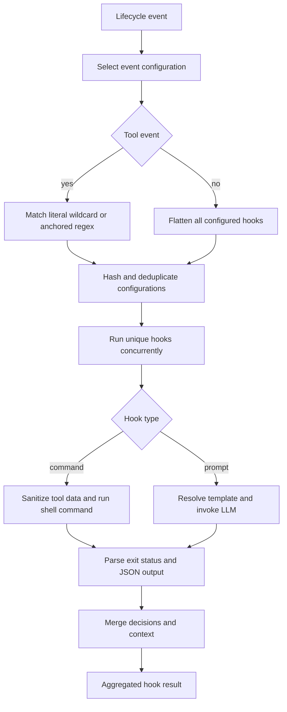
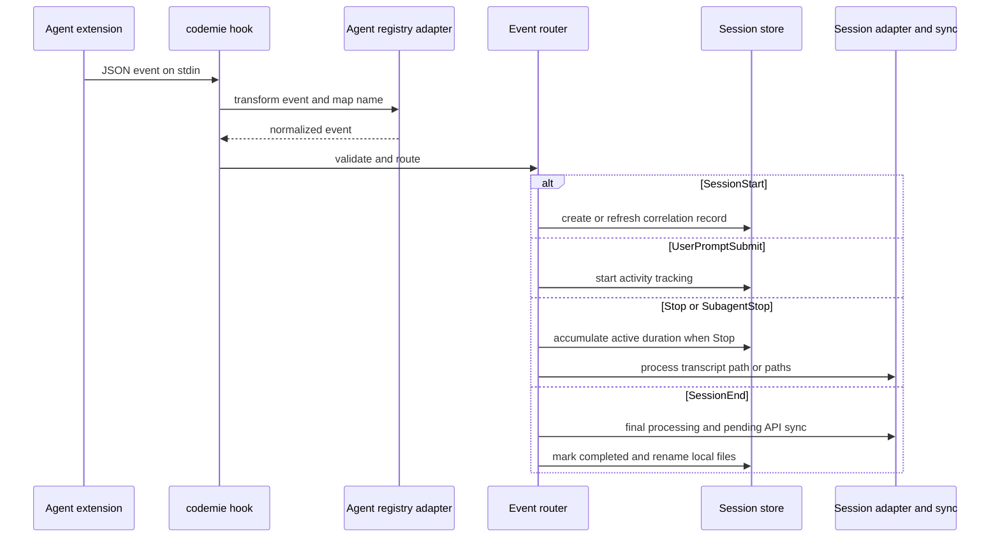

# Hooks, Extensions, Skills, Frameworks, and Workflow Templates

CodeMie has several similarly named mechanisms with deliberately different owners and effects:

- **The configurable hook engine** (`src/hooks/`) evaluates locally configured command or LLM hooks around tool, prompt, stop, and session lifecycle points. It can return a decision or conversation context.
- **The `codemie hook` command** is a separate integration boundary for installed agent plugins/extensions. It reads an agent event from standard input, normalizes it through the selected agent adapter, and performs session correlation, activity accounting, transcript processing, and best-effort analytics work. It is not the configurable `HookExecutor` dispatcher.
- **Extensions** package the integration files—including an agent-native `hooks/hooks.json`—that cause an external agent to invoke that command.
- **Skills** are Markdown instruction bundles discovered by CodeMie or installed for a target agent. Assistant setup can generate target-agent skill/subagent wrappers; `SkillSync` copies CodeMie-managed skill directories into Claude Code’s discovery location.
- **Frameworks** are registered adapters for external development methodologies and CLIs. They are installed/initialized through the agent CLI rather than being skill content.
- **Workflow templates** are versioned CI definitions copied into the current VCS repository. They are not agent hook definitions.

## Configurable hook execution

`HooksConfiguration` maps lifecycle event names to matchers, whose `hooks` are either `command` or `prompt` configurations. A command needs `command`; a prompt hook needs `prompt`; both may set a timeout (60 seconds is the command default). Inputs include correlation and execution context—session ID, transcript path, working directory, permission mode, agent/profile names—and event-specific tool, output, prompt, or execution-history fields. Results can decide `allow`, `deny`, `block`, or `approve`, optionally supply a reason, additional context, modified tool input, output suppression, or a permission decision.

Tool events use their matcher; an omitted matcher means `*`. `*` matches every tool. Patterns containing `|`, character-class brackets, braces, or parentheses are compiled as an anchored regular expression; other patterns are literals. Invalid regular expressions fall back to a literal comparison. `UserPromptSubmit`, `Stop`, and `SessionStart` flatten all configured matchers and therefore run all their hooks rather than filtering by tool name.

This shows the standalone configurable hook engine’s match, execution, and decision path.

### Execution, decisions, and safety properties

`HookExecutor` hashes type, command/prompt, and effective timeout to remove duplicates both within a dispatch and until `clearCache()` starts a new event cycle. It runs the remaining hooks with `Promise.allSettled`, so one rejected task does not stop the others. Command hooks run in the configured working directory with shell parsing, receive context in `CODEMIE_*` environment variables, and currently receive serialized JSON through `CODEMIE_HOOK_INPUT`. Before serialization, `tool_input` and `tool_output` are passed through `sanitizeValue`.

Hook stdout is expected to be JSON, but empty output means allow and non-JSON output becomes `additionalContext`. Exit code `2` produces a blocking result with stderr/stdout feedback; other nonzero exits fail open as `allow` while retaining feedback. Execution errors, an unknown hook type, a missing required command/prompt, missing LLM configuration, and prompt invocation failures also fail open. When several hooks return successfully, decision precedence is **block > deny > approve > allow**; all additional contexts are joined and later `updatedInput` values override earlier keys. The executor’s `PostToolUse` result is documented as informational, while its pre-tool, prompt, stop, and session calls expose the aggregated decision to their caller.

Prompt hooks use `ChatOpenAI` at temperature zero, default model `gpt-3.5-turbo`, and a 30-second default request timeout. Templates may substitute `$ARGUMENTS`, `$TOOL_NAME`, `$TOOL_INPUT`, `$PROMPT`, `$SESSION_ID`, and `$CWD`. JSON replies are validated; a plain-text reply is treated as a denial only if it contains blocking language such as “block”, “deny”, “reject”, or “prevent”.

> **Operational caution:** hook commands execute with the invoking user’s environment and shell. Treat configurations as trusted code. Do not write raw hook payloads, cookie headers, API keys, or unredacted tool output to diagnostics. Use `logger.debug()` for diagnostics and sanitize credential-adjacent values before logging or forwarding them.

## Agent hook-event routing and extension installation

Agent-native plugin hooks invoke `codemie hook`. In CLI mode, the command reads JSON from stdin and requires an event session ID and event name. It establishes logger context from `CODEMIE_AGENT` and `CODEMIE_SESSION_ID`; after agent transformation it requires a transcript path except for `SessionStart` and `SessionEnd`. Programmatic callers use `processEvent(event, config)` and receive errors instead of process termination for validation/handler failures.

An adapter may supply `getHookTransformer()` and an event-name mapping. Transformation precedes the internal transcript validation, which lets an adapter derive a path that its native payload did not provide. Unknown events are ignored. The supported route set is `SessionStart`, `SessionEnd`, `PermissionRequest`, `Stop`, `UserPromptSubmit`, `SubagentStop`, and `PreCompact`.

This is the agent hook-event boundary; it is distinct from the configurable hook-engine diagram above.

On `SessionStart`, the router creates or refreshes the CodeMie session correlation record, starts best-effort start metrics work, and non-blockingly runs `SkillSync.syncToClaude()` for the event working directory. Re-entry into a still-active record preserves its start and accumulated-active-time values. A `UserPromptSubmit` can enforce the analytics-auth gate when analytics is configured: invalid/missing credentials or a saved invalid-auth marker block the native CLI prompt with exit code 2, while programmatic mode throws for the host to surface. It then starts active-time tracking. `Stop` accumulates active duration and incrementally processes every supplied transcript path; `SessionEnd` does final processing/API synchronization, sends end metrics when configured, marks the session complete, then renames session, metrics, and conversation files with `completed_` prefixes. Most telemetry, session-processing, and skill-sync failures are caught so they do not otherwise block agent execution.

`BaseExtensionInstaller` is the reusable installer for these agent-specific integration bundles. Subclasses provide source/target paths, manifest path, and critical files. `install()` reads source and installed manifest versions; an absent or version-different valid install triggers a clean replacement copy, while equal/unknown versions are retained. It verifies critical files and parses critical JSON before reporting success, then best-effort rewrites copied hook commands to an absolute CodeMie binary path. Installation failure returns `action: 'failed'` rather than throwing from the base workflow, meaning agent use can continue without extension hooks.

Manifests may also enable a selective project-local copy. `local-install.json` is preferred, with legacy manifest configuration accepted as fallback. Whitelist, blacklist, and hybrid include/exclude strategies use normalized forward-slash paths so Windows glob matching remains correct; overwrite policy is `always`, `never`, or `newer`. A per-agent version record under the CodeMie home controls whether the local copy is refreshed.

## Skills and assistant setup

A CodeMie skill is a `SKILL.md` with validated YAML frontmatter: non-empty `name` and `description`, optional version/author/license/modes/compatibility, and numeric priority. Discovery searches up to three levels under these roots:

| Source | Root | Base priority |
| --- | --- | ---: |
| Project | `<cwd>/.codemie/skills/` | 1000 |
| Mode-specific | `~/.codemie/skills-<mode>/` | 500 |
| Enabled plugin | resolved plugin skills and commands | 200 |
| Global | `~/.codemie/skills/` | 100 |

The effective priority is source base plus frontmatter priority. Same-name skills are deduplicated so the higher value wins, then results are filtered by compatible agent and requested mode and sorted descending. A malformed/unreadable file is excluded rather than failing all discovery. Discovery caches by working directory, mode, and agent; `SkillManager.reload()` clears it. Pattern-based invocation can load named skills with an inventory of their companion files.

There are two CLI surfaces. `codemie skill` manages the internal discovery model: `list`, `validate`, `reload`, and `sync` (currently target `claude` only). In contrast, plural `codemie skills` is an authenticated wrapper around the upstream `skills` CLI for catalog/distribution operations such as add, update, remove, list, and find. Its add command accepts a repository, URL, local path, or well-known endpoint, can select target agents, forces copy mode on Windows, disables interactive Git credential prompts, sanitizes the source used in metrics, and applies a two-minute Git operation limit.

`SkillSync` refreshes discovery, then copies each discovered skill’s *entire containing directory* to `<cwd>/.claude/skills/<skill-name>`, skipping hidden directories and `node_modules`. `.claude/skills/.codemie-sync.json` records source path and `SKILL.md` mtime, enabling unchanged skills to be skipped. `--dry-run` reports without writes. `--clean` removes only manifest-tracked skill directories no longer discovered—but the implementation returns early when discovery finds zero skills, so that invocation does not clean all prior output. Individual copy/cleanup errors are accumulated in the result rather than aborting the whole sync.

`codemie setup assistants` authenticates, loads existing registrations, lets the user select server assistants and choose subagent versus skill representation, selects global or local storage, and targets Claude, Codex, and/or Gemini. It unregisters removed or reconfigured artifacts before generating replacements, then persists the selected registration set to the chosen CodeMie configuration scope. For Claude, agent mode writes `<scope>/.claude/agents/<slug>.md`; skill mode writes `<scope>/.claude/skills/<slug>/SKILL.md`. Generated wrappers invoke `codemie assistants chat <id>` and instruct callers to mint and reuse a task-specific `--conversation-id`, preventing unrelated assistant calls in one agent session from sharing implicit context. Codex and Gemini use their respective assistant-skill generators for either selected mode.

## Framework adapters

Importing `src/frameworks/index.ts` imports the plugins module, whose side effect registers `SpeckitPlugin`, `BmadPlugin`, and `CodebaseMemoryPlugin` in the static `FrameworkRegistry`. The registry returns only available adapters and can filter by `metadata.supportedAgents`; an absent/empty supported-agent list means all agents.

A framework adapter encapsulates installing/uninstalling an external CLI, detecting initialization in the project, mapping a CodeMie agent name to the framework’s name, reporting a version, and initializing. `BaseFrameworkAdapter` provides ordinary CLI detection with `--version` then `which`, five-second/ two-second limits, and init-directory existence checks; concrete adapters own their commands and dependency/error behavior. The agent CLI exposes `codemie-<agent> init --list` and `codemie-<agent> init <framework>`: it rejects unknown or unsupported framework/agent pairs and passes force, current directory, and framework-specific options to `init`. `codemie install <framework>` consults the same registry for installation.

For example, SpecKit supports Claude and Gemini, detects `.specify`, installs `specify-cli` through `uv` from the upstream Git repository after verifying `uv` and Git, and initializes in place with the mapped agent plus an OS-specific shell/PowerShell script option. It refuses an already initialized project unless forced.

## Repository workflow templates

`codemie workflow list`, `install <workflow-id>`, and `uninstall <workflow-id>` manage CI templates. Provider autodetection first confirms a Git work tree and then derives GitHub or GitLab from the `origin` URL; callers can override it with `--github` or `--gitlab`. GitHub files belong in `.github/workflows`; GitLab files belong in `.gitlab` according to this installer. The registry has GitHub template metadata for `pr-review`, `inline-fix`, and `code-ci`; the GitLab metadata list is currently empty.

Install resolves a template by ID and provider, creates the provider directory, and writes `codemie-<id>.yml`. An existing install is skipped unless `--force`; `--dry-run` prints the destination and rendered content without writing. It can replace recognized timeout, max-turns fallback, and environment fields in the template. Dependency validation reports required/optional repository secrets and tools as warnings; it cannot verify secret values. Therefore installing a file is not operational readiness: configure the required secrets, commit and push the generated definition, and review its declared triggers and permissions before enabling it. Uninstall only removes the installed file; it does not remove prior CI runs or history.

## Focused verification

The focused hook tests exercise matching, decision parsing, command input/environment propagation, blocking exit code 2, fail-open errors, deduplication, and cache reset. Skill-sync tests isolate `CODEMIE_HOME` and a temporary project, then verify whole-directory copy and manifest creation, mtime-based skipping/re-sync, dry runs, and guarded orphan cleanup. Extension installer tests cover hook-command localization and Windows path behavior; framework plugin tests cover their concrete adapters. Workflow integration tests cover the CLI/install flow. For changes that can write or delete user files, retain temporary-directory isolation and explicitly test `--dry-run`, no-op/up-to-date, force, and cleanup paths.

## Related pages

- [CLI surface](/openwiki/architecture/cli-surface.md)
- [Configuration and local state](/openwiki/concepts/configuration-and-local-state.md)
- [Agent plugin system](/openwiki/integrations/agent-plugin-system.md)
- [Agent launch and session telemetry](/openwiki/workflows/agent-launch-and-session-telemetry.md)
- [Test strategy](/openwiki/testing/test-strategy.md)
